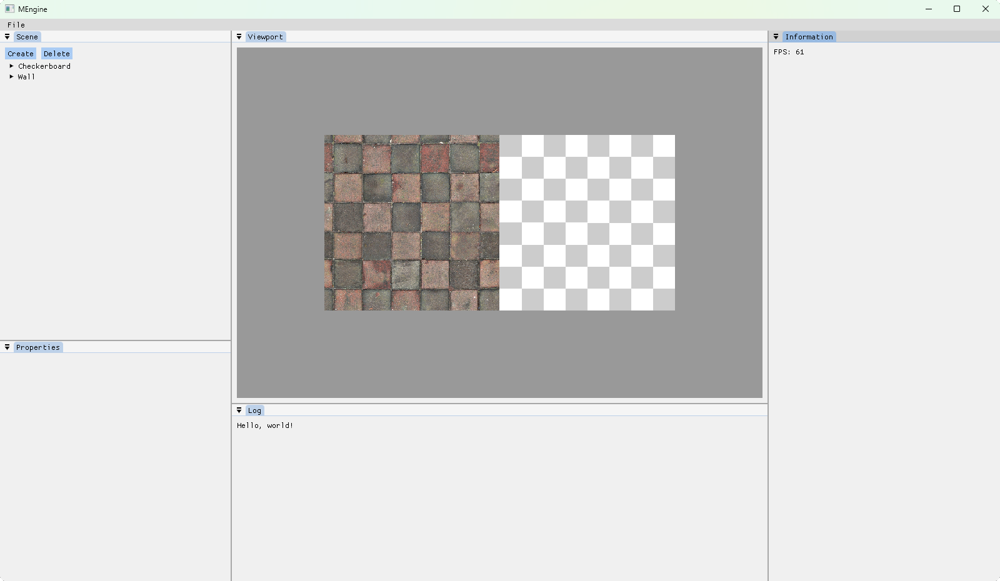

# MEngine

> [!TIP]
> Just for fun!

a simple game engine!

## Features

- Entity Component System
- Lua Scripting
- ImGui Debugging
- 2D Rendering

## Quick start

### Third-party Dependences

This project contains these third-party libraries:

- entt
- glad
- glfw
- glm
- imgui
- lua
- spdlog
- stb

These libraries are included as submodules in the `deps` directory. You can clone the repository with the `--recursive` flag to automatically clone these submodules.

### Get source code

```bash
git clone --recursive https://github.com/MiaoHN/MEngine.git
```

### Environment

> [!IMPORTANT]
> Only test building on **Windows11**.

Build environment:

- Windows 11
- CMake 3.29.2

### Build

```bash
mkdir build
cd build
cmake ..
cmake --build . --config Release
```

## Screenshots



## License

This project is licensed under the MIT License - see the [LICENSE](./LICENSE) file for details.
