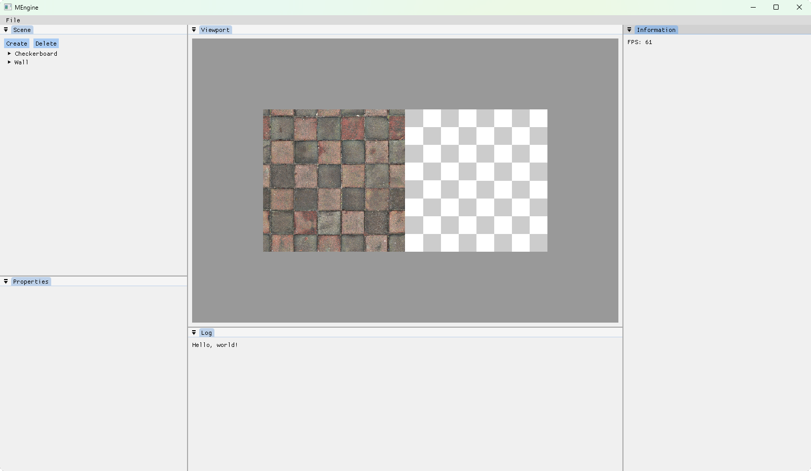

# MEngine

> [!TIP]
> Just for fun!

a simple game engine!

## Features

- Entity Component System
- Lua Scripting
- ImGui Debugging
- 2D Rendering

## Quick start

### Third-party Dependences

This project contains these third-party libraries:

- entt
- glad
- glfw
- glm
- imgui
- lua
- spdlog
- stb

These libraries are included as submodules in the `deps` directory. You can clone the repository with the `--recursive` flag to automatically clone these submodules.

### Get source code

```bash
git clone --recursive https://github.com/MiaoHN/MEngine.git
```

### Environment

> [!NOTE]
> This project builds on **Windows**, **Linux** and **macOS**; CI verifies all three.

Supported toolchains (managed via [CMakePresets.json](./CMakePresets.json)):

| Platform | Toolchains                         |
| -------- | ---------------------------------- |
| Windows  | MSVC, Clang                        |
| Linux    | GCC, Clang                         |
| macOS    | AppleClang                         |

Requirements:

- CMake ≥ 3.21
- Ninja
- (Optional) Vulkan SDK — if missing, the engine falls back to OpenGL-only.

### Build with presets

All build parameters (generator, compiler, build type) live in `CMakePresets.json`, so the
same commands work on every platform. Run `cmake --list-presets` to see what's available
on your machine.

```bash
# Configure (pick the preset matching your platform/toolchain)
cmake --preset windows-msvc-debug       # Windows + MSVC + Debug
cmake --preset windows-msvc-release     # Windows + MSVC + Release
cmake --preset linux-gcc-debug          # Linux + GCC + Debug
cmake --preset linux-clang-release      # Linux + Clang + Release
cmake --preset macos-release            # macOS + AppleClang + Release

# Build
cmake --build --preset windows-msvc-debug

# Run tests (if any)
ctest --preset windows-msvc-debug
```

> [!TIP]
> On Windows the `windows-msvc-*` presets use the Ninja generator, so run them from a
> **Developer PowerShell / Developer Command Prompt** so that `cl.exe` is on `PATH`.
> The `windows-clang-*` presets need an MSVC-compatible Clang environment on `PATH`.

### Linux dependencies

Ubuntu/Debian packages required by GLFW:

```bash
sudo apt-get install -y ninja-build \
  libxrandr-dev libxinerama-dev libxcursor-dev libxi-dev libxext-dev \
  libwayland-dev libxkbcommon-dev libgl1-mesa-dev
```

### macOS dependencies

`brew install ninja` (Ninja is usually already available via the Command Line Tools).

## Screenshots



## License

This project is licensed under the MIT License - see the [LICENSE](./LICENSE) file for details.
