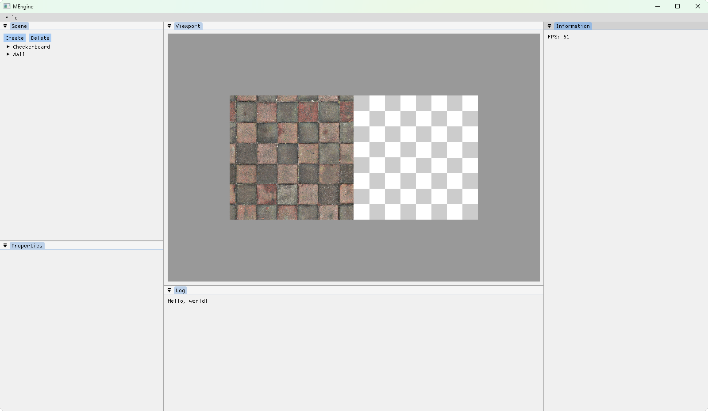

# MEngine

> [!TIP]
> Just for fun!

A small game engine — **2D and 3D are both first-class** — with an ImGui/ImGuizmo editor.

- **ECS** (EnTT) + parent/child scene hierarchy, JSON scene files with a per-scene **2D/3D dimension**
- **Rendering**: OpenGL 4.6 via an RHI abstraction — PBR / Blinn-Phong / LO-exact shader pipelines,
  directional + point + spot shadows, IBL, SSAO, bloom, god rays, TAA…
- **2D**: a dedicated sprite path (no 3D stages, so pixels equal the source art), sorting layers,
  texture tiling, sprite-sheet animation, simple Lua character controllers
- **Lua scripting** (per-entity `OnStart/OnUpdate/OnFixedUpdate/OnDestroy`)
- **Jolt physics**, **miniaudio** audio
- **Editor**: 3D viewport + separate 2D viewport, gizmos, material/model inspectors, timeline keyframes,
  content browser, script editor, one-click standalone launch

📖 **Documentation: [miaohn.github.io/MEngine](https://miaohn.github.io/MEngine/)** (source in [`docs/`](./docs/README.md))

## Quick start

### Third-party dependencies

This project contains these third-party libraries (git submodules in `deps/`):

entt · glad · glfw · glm · imgui · ImGuizmo · jolt · lua · miniaudio · nlohmann · stb · tinygltf

Clone the repository with `--recursive` so the submodules come along.

### Get source code

```bash
git clone --recursive https://github.com/MiaoHN/MEngine.git
```

### Environment

> [!NOTE]
> This project builds on **Windows**, **Linux** and **macOS**; CI verifies all three.

Supported toolchains (managed via [CMakePresets.json](./CMakePresets.json)):

| Platform | Toolchains  |
| -------- | ----------- |
| Windows  | MSVC, Clang |
| Linux    | GCC, Clang  |
| macOS    | AppleClang  |

Requirements:

- CMake ≥ 3.21
- Ninja
- (Optional) Vulkan SDK — if missing, the engine falls back to OpenGL-only.

### Build with presets

All build parameters (generator, compiler, build type) live in `CMakePresets.json`, so the
same commands work on every platform. Run `cmake --list-presets` to see what's available
on your machine.

```bash
# Configure (pick the preset matching your platform/toolchain)
cmake --preset windows-msvc-debug       # Windows + MSVC + Debug
cmake --preset windows-msvc-release     # Windows + MSVC + Release
cmake --preset linux-gcc-debug          # Linux + GCC + Debug
cmake --preset linux-clang-release      # Linux + Clang + Release
cmake --preset macos-release            # macOS + AppleClang + Release

# Build
cmake --build --preset windows-msvc-debug

# Run tests (if any)
ctest --preset windows-msvc-debug
```

> [!TIP]
> On Windows the `windows-msvc-*` presets use the Ninja generator, so run them from a
> **Developer PowerShell / Developer Command Prompt** so that `cl.exe` is on `PATH`.
> The `windows-clang-*` presets need an MSVC-compatible Clang environment on `PATH`.

### Targets

| Target | What it is |
| ------ | ---------- |
| `editor` | The editor (3D viewport, 2D viewport, gizmos, inspectors, timeline) |
| `sandbox3d` / `sandbox2d` | Minimal 3D / 2D apps — also the standalone players the editor's **Launch** button starts |
| `voxel` | Voxel demo (async chunk streaming, resident chunks) |
| `examples/*` | LearnOpenGL ports, one executable per example (see [`examples/PORTING.md`](./examples/PORTING.md)) |

```bash
# Standalone players accept a scene file saved by the editor:
./build/windows-clang-debug/sandbox2d/sandbox2d.exe --scene assets/scenes/my_2d_scene.scene
./build/windows-clang-debug/sandbox3d/sandbox3d.exe --scene assets/scenes/physics_test.scene

# Unattended runs (headless, frame budget, capture the backbuffer):
./build/windows-clang-debug/sandbox2d/sandbox2d.exe --frames 120 --hidden --capture-frame 100
```

### Linux dependencies

Ubuntu/Debian packages required by GLFW:

```bash
sudo apt-get install -y ninja-build \
  libxrandr-dev libxinerama-dev libxcursor-dev libxi-dev libxext-dev \
  libwayland-dev libxkbcommon-dev libgl1-mesa-dev
```

### macOS dependencies

`brew install ninja` (Ninja is usually already available via the Command Line Tools).

### Documentation site

The docs are Markdown under `docs/` and are published with
[MkDocs Material](https://squidfunk.github.io/mkdocs-material/):

```bash
python -m pip install -r requirements-docs.txt
python -m mkdocs serve            # http://127.0.0.1:8000
python -m mkdocs build --strict   # the same check CI runs
```

## Screenshots



## License

This project is licensed under the MIT License - see the [LICENSE](./LICENSE) file for details.
