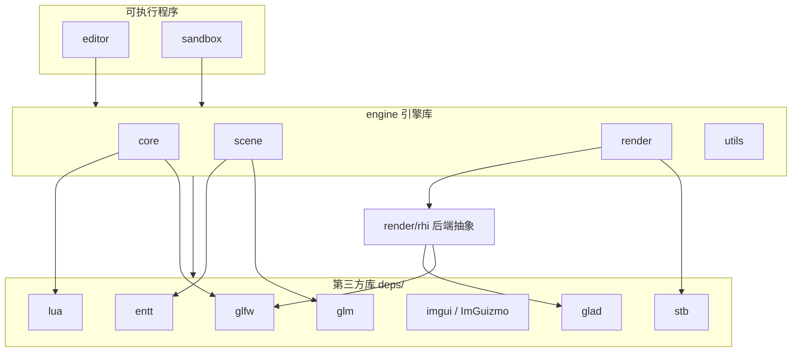
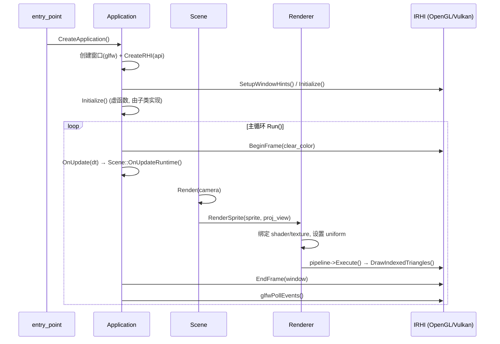

# 架构总览

## 顶层结构

MEngine 由三层组成，自底向上为：

- **`engine`**：静态库，包含引擎全部能力。由 `core`、`scene`、`render`、`utils` 四个子模块组成。
- **`editor`**：基于 ImGui 的编辑器可执行程序，继承 `Application`。
- **`sandbox`**：最小示例可执行程序，继承 `Application`，展示一个旋转方块 Sprite。
- **`deps`**：git submodule 引入的第三方库。

## 模块职责

| 模块 | 路径 | 职责 |
| --- | --- | --- |
| `core` | `engine/src/core` | 应用生命周期、主循环、日志、平台、Lua 脚本、UUID、输入、命令 |
| `scene` | `engine/src/scene` | ECS（基于 EnTT）、Entity 封装、组件、Scene 管理、2D 相机 |
| `render` | `engine/src/render` | 渲染高层抽象（Renderer/Pipeline/Pass）、资源（Shader/Texture/FrameBuffer）、RHI 后端 |
| `render/rhi` | `engine/src/render/rhi` | 图形 API 抽象层：`IRHI` + 资源 Backend 工厂，OpenGL/Vulkan 实现 |
| `utils` | `engine/src/utils` | 性能剖析器（profiler） |
| `editor` | `editor/src` | ImGui 编辑器界面与交互 |
| `sandbox` | `sandbox/src` | 示例场景 |

## 关键设计模式

### 1. 智能指针约定
- `Ref<T>` = `std::shared_ptr<T>`，`CreateRef<T>(...)` = `std::make_shared<T>(...)`（见 `core/common.hpp`）。
- 面向外部的资源统一用 `Ref<Texture/Shader/FrameBuffer>` 等**高层包装类**持有；后端实现（`I*Backend`）通过 `std::unique_ptr` 由包装类独占。
- ⚠️ 不要对外暴露 `Ref<I*Backend>` 这种抽象接口的 shared_ptr，否则 `CreateRef` 可能实例化抽象接口。

### 2. RHI 抽象 + 资源 Backend 工厂
- 高层代码只面向抽象接口（`IRHI`、`ITextureBackend` 等）。
- `render/rhi/resource_backend.cpp` 中的工厂函数（`CreateTextureBackend()` 等）根据当前激活的 RHI（`GetActiveRHI()->GetAPI()`）选择 OpenGL 或 Vulkan 实现。
- 这为将来扩展到其他图形 API（Metal / DirectX）保留了入口。

### 3. ECS（EnTT）
- `Scene` 内部持有 `entt::registry`；`Entity` 是对 `entt::entity + registry*` 的轻量封装，提供模板化的 `AddComponent/GetComponent/HasComponent/RemoveComponent`。

### 4. 单一入口
- `entry_point.cpp` 提供 `main()`，调用用户定义的 `CreateApplication()` 返回 `Application*`，然后依次 `Initialize()` → `Run()`。
- `editor` 和 `sandbox` 各自实现 `CreateApplication()`。

## 运行时数据流（当前 2D 渲染路径）

## 当前状态与已知局限

- 渲染为 **2D**：只有 Sprite 渲染管线（一个四边形 VAO + 默认 shader），无 3D 网格/模型。
- **Vulkan 后端是半成品**：`VulkanRHI` 有 swapchain 等初始化代码，但 `Vulkan*ResourceBackend` 大多是空壳（如 `VulkanTextureBackend` 只在 CPU 端缓存像素，`VulkanShaderBackend` 只缓存矩阵，`IsValid()` 恒返回 false）。
- `Scene::LoadScene/SaveScene`、`OnUpdateSimulation` 等仍为 TODO。
- `RenderContext` 类与 `RenderPass` 高度相似，疑似未完成的重复抽象。
- `command.hpp` 中的 Command/RenderCommand 目前未被渲染主路径使用。

详见 [roadmap.md](./roadmap.md) 中的 3D 化改造计划。
