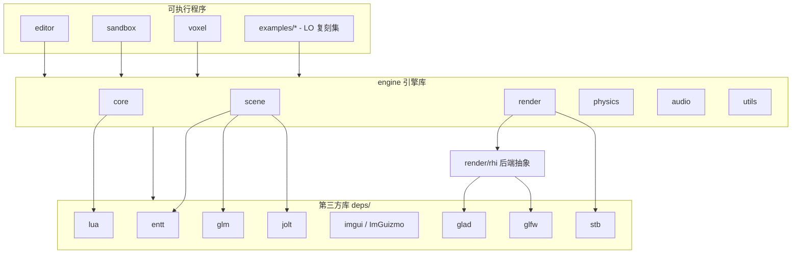
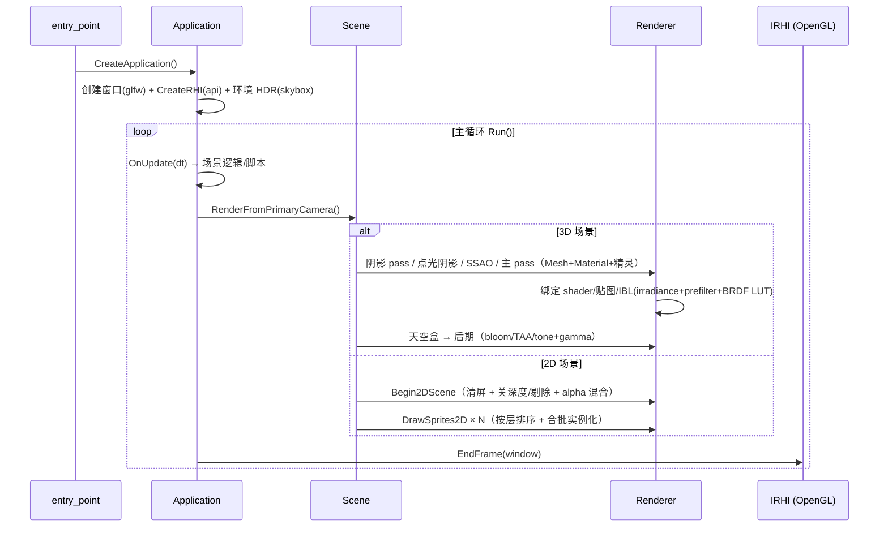

# 架构总览

## 顶层结构

MEngine 由三层组成，自底向上为：

```mermaid
graph TB
    subgraph Apps["可执行程序"]
        ED[editor]
        SB[sandbox]
        VX[voxel]
        EX[examples/* - LO 复刻集]
    end

    subgraph Engine["engine 引擎库"]
        CORE[core]
        SCENE[scene]
        RENDER[render]
        PHYS[physics]
        AUDIO[audio]
        UTILS[utils]
    end

    subgraph Deps["第三方库 deps/"]
        ENTT[entt]
        GLFW[glfw]
        GLAD[glad]
        GLM[glm]
        IMGUI[imgui / ImGuizmo]
        JOLT[jolt]
        LUA[lua]
        STB[stb]
    end

    ED --> Engine
    SB --> Engine
    VX --> Engine
    EX --> Engine
    Engine --> Deps

    RENDER --> RHI["render/rhi 后端抽象"]
    RHI --> GLAD
    RHI --> GLFW
    SCENE --> ENTT
    SCENE --> GLM
    SCENE --> JOLT
    CORE --> LUA
    RENDER --> STB
```

- **`engine`**：静态库，含引擎全部能力，由 `core`/`scene`/`render`/`physics`/`audio`/`utils` 子模块组成。
- **`editor`**：基于 ImGui 的编辑器可执行程序（3D 视口 + 2D 视口/层级/材质/光照/Gizmo，继承 `Application`）。
- **`sandbox3d` / `sandbox2d`**：最小 3D / 2D 示例可执行程序（也是编辑器 Launch 选中的独立播放器），继承 `Application`。
- **`voxel`**：体素应用（继承 `Application`）。
- **`examples`**：**LearnOpenGL 1:1 复刻集**——每个 LO demo 一个独立 exe（`example_<name>`），共享宿主 `examples/src/example_app.*`、工具 `example_helpers.hpp`；每 exe 自带 `assets/` 副本（POST_BUILD copy_directory）。LO→MEngine 对照与覆盖见 `examples/PORTING.md`。
- **`deps`**：git submodule 引入的第三方库。

## 模块职责

| 模块 | 路径 | 职责 |
| --- | --- | --- |
| `core` | `engine/src/core` | 应用生命周期、主循环、日志、平台、Lua 脚本、UUID、输入、命令、窗口标题/抓帧等静态配置 |
| `scene` | `engine/src/scene` | ECS（基于 EnTT）、Entity 封装、组件、Scene 管理、3D `Camera`、Lua 脚本与物理体的挂接 |
| `render` | `engine/src/render` | 渲染高层抽象（`Renderer` 的阶段式接口 + 专用 2D 通道）、Mesh/Material/模型导入、精灵与帧动画、阴影/SSAO/IBL/后期、资源与 shader 管理 |
| `render/rhi` | `engine/src/render/rhi` | 图形 API 抽象层：`IRHI` + 资源 Backend 工厂，OpenGL/Vulkan 实现 |
| `physics` | `engine/src/physics` | Jolt 物理封装 |
| `audio` | `engine/src/audio` | 音频 |
| `utils` | `engine/src/utils` | 性能剖析器（profiler） |
| `editor` | `editor/src` | ImGui 编辑器界面与交互（3D / 2D 视口、层级、材质、光照、Gizmo） |
| `sandbox` | `sandbox/src` | 最小示例场景（`sandbox_3d.*` / `sandbox_2d.*`） |
| `examples` | `examples/src` | LO 复刻示例（`example_app.*` 共享宿主 + 每 demo 场景） |

## 关键设计模式

### 1. 智能指针约定
- `Ref<T>` = `std::shared_ptr<T>`，`CreateRef<T>(...)` = `std::make_shared<T>(...)`（见 `core/common.hpp`）。
- 面向外部的资源统一用 `Ref<Texture/Shader/FrameBuffer>` 等**高层包装类**持有；后端实现（`I*Backend`）通过 `std::unique_ptr` 由包装类独占。
- ⚠️ 不要对外暴露 `Ref<I*Backend>` 这种抽象接口的 shared_ptr，否则 `CreateRef` 可能实例化抽象接口。

### 2. RHI 抽象 + 资源 Backend 工厂
- 高层代码只面向抽象接口（`IRHI`、`ITextureBackend` 等）。
- `render/rhi/resource_backend.cpp` 中的工厂函数（`CreateTextureBackend()` 等）根据当前激活的 RHI（`GetActiveRHI()->GetAPI()`）选择 OpenGL 或 Vulkan 实现。
- 这为将来扩展到其他图形 API（Metal / DirectX）保留了入口。

### 3. ECS（EnTT）
- `Scene` 内部持有 `entt::registry`；`Entity` 是对 `entt::entity + registry*` 的轻量封装，提供模板化的 `AddComponent/GetComponent/HasComponent/RemoveComponent`。

### 4. 单一入口
- `entry_point.cpp` 提供 `main()`，调用用户定义的 `CreateApplication()` 返回 `Application*`，然后依次 `Initialize()` → `Run()`。
- `editor` / `sandbox3d` / `sandbox2d` 各自实现 `CreateApplication()`。

## 运行时数据流

两条渲染路径由 **场景维度**（`Scene::Is2D()`）选择，入口统一是 `Scene::RenderFromPrimaryCamera()`：

- **3D**：`Scene::RenderMeshes` → `Renderer`（阴影/SSAO/主 pass）→ 天空盒 → 后期
  （bloom/god rays/TAA/tone+gamma）。
- **2D**：`Scene::Render2D` → `Renderer::Begin2DScene/DrawSprites2D/End2DScene` —— 一次清屏 + 精灵
  实例化批次，不经过任何 3D 阶段与后期。

完整说明见 [rendering.md](./rendering.md) 与 [2d.md](./2d.md)；`examples/`（LO 复刻宿主）即 3D 最简完整用法。

```mermaid
sequenceDiagram
    participant Main as entry_point
    participant App as Application
    participant Scene
    participant Renderer
    participant RHI as IRHI (OpenGL)

    Main->>App: CreateApplication()
    App->>App: 创建窗口(glfw) + CreateRHI(api) + 环境 HDR(skybox)
    loop 主循环 Run()
        App->>App: OnUpdate(dt) → 场景逻辑/脚本
        App->>Scene: RenderFromPrimaryCamera()
        alt 3D 场景
            Scene->>Renderer: 阴影 pass / 点光阴影 / SSAO / 主 pass（Mesh+Material+精灵）
            Renderer->>Renderer: 绑定 shader/贴图/IBL(irradiance+prefilter+BRDF LUT)
            Scene->>Renderer: 天空盒 → 后期（bloom/TAA/tone+gamma）
        else 2D 场景
            Scene->>Renderer: Begin2DScene（清屏 + 关深度/剔除 + alpha 混合）
            Scene->>Renderer: DrawSprites2D × N（按层排序 + 合批实例化）
        end
        App->>RHI: EndFrame(window)
    end
```

## 当前状态与已知局限

- 渲染有 **两条一等路径**：3D PBR（阴影/SSAO/IBL(split-sum BRDF LUT)/后期/三套材质管线）与
  **独立 2D 精灵路径**（平铺、帧动画、sorting layer）。里程碑见 [status.md](./status.md)（M1–M7）；
  渲染层细节与剩余局限见 [rendering.md](./rendering.md)。
- **Vulkan 后端是半成品**：`VulkanRHI` 有 swapchain 等初始化代码，但 `Vulkan*ResourceBackend` 大多是空壳。
- 场景序列化（JSON）已实现：`OpenSceneFile` 是唯一加载器（编辑器与独立播放器共用），
  `LoadScene` 只是「清空后转发」，见 [scene.md](./scene.md)；editor File→Open/Save 与 Play 快照在用。
- 早期 2D 时代的绘制抽象（`RenderPipeline` / `RenderPass` / `RenderContext` / `core/command.hpp`）
  与旧 `Sprite2D` / `AnimatedSprite2D` 组件均已删除，不再有新代码引用。
