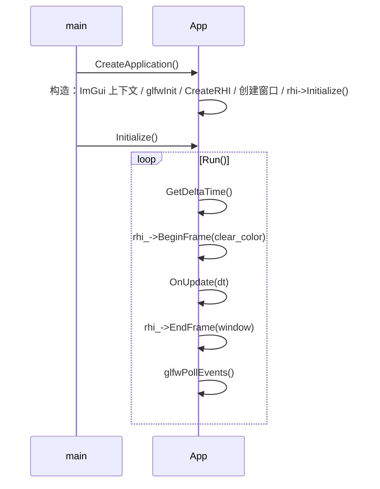

# 核心层（core）

路径：`engine/src/core`

## 模块清单

| 文件 | 职责 |
| --- | --- |
| `common.hpp` | 通用类型与宏：`Ref`/`CreateRef`、GLFW 引入、`ERROR` 宏处理 |
| `application.hpp/.cpp` | 引擎应用基类：窗口创建、主循环、RHI 生命周期、帧率统计 |
| `entry_point.hpp/.cpp` | 统一 `main()` 入口 |
| `logger.hpp/.cpp` | 流式日志（`LOG_TRACE/INFO/WARN/ERROR/FATAL`），输出到文件与 stdout |
| `platform.hpp` | 平台类型枚举（Windows/Linux/macOS/iOS/Android） |
| `script_engine.hpp/.cpp` | Lua 脚本加载与执行 |
| `uuid.hpp/.cpp` | 基于 `mt19937_64` 随机数的 64 位 UUID |
| `input.hpp` | 键盘输入（基于 GLFW） |
| `command.hpp` | 命令模式基类（`Command` / `RenderCommand`），当前未被渲染主路径使用 |

## Application 生命周期

`Application` 是引擎的基类，用户应用（editor、sandbox）继承它并实现：

```cpp
Application *CreateApplication();   // 用户实现，返回应用实例
virtual void Initialize();          // 初始化（子类可重写）
virtual void OnUpdate(float dt);    // 每帧逻辑（子类可重写）
```

生命周期（见 `entry_point.cpp` + `application.cpp`）：



- 构造时即创建窗口（1600×900）与 RHI；`GraphicsAPI` 由构造参数决定（默认 `OpenGL`）。
- `Run()` 是主循环，`while (!glfwWindowShouldClose(window_))`。
- `GetDeltaTime()` 同时完成 FPS 统计（每秒刷新 `fps_`）。

关键成员：

| 成员 | 类型 | 说明 |
| --- | --- | --- |
| `window_` | `GLFWwindow*` | GLFW 窗口 |
| `rhi_` | `Ref<IRHI>` | 当前渲染后端（OpenGL/Vulkan） |
| `graphics_api_` | `GraphicsAPI` | 期望的图形 API |
| `scene_` | `Ref<Scene>` | 场景（当前基类中定义但主要由编辑器使用） |
| `frame_buffer_` | `Ref<FrameBuffer>` | 离屏帧缓冲 |
| `script_engine_` | `Ref<ScriptEngine>` | Lua 脚本引擎 |

## Logger

流式日志，形如：

```cpp
LOG_INFO("Application") << "Application started";
```

输出格式：`[time] [LEVEL] [name] message`，同时写入 `mengine.log` 与 stdout。

- `Logger::Level` 枚举：`TRACE/DEBUG/INFO/WARN/ERROR/FATAL`。
- `LOG_DEBUG` 在 `NDEBUG`（Release）下被编译为空。
- ⚠️ 跨平台注意：`ERROR` 枚举成员与 Windows 的 `ERROR` 宏冲突，由 `common.hpp` 处理。

## ScriptEngine（Lua）

- 构造 `luaL_newstate()`，析构 `lua_close()`。
- `LoadScript(path)`：`luaL_loadfile` + `lua_pcall`，随后 `luaL_openlibs`，并调用脚本中的全局 `init()` 函数。
- 典型用法见 `editor.cpp::Initialize()` 加载 `res/scripts/test.lua`。

## Platform

`platform.hpp` 中 `Platform::get_platform_type()` 通过预处理宏（`_WIN32` / `__APPLE__` / `__linux__` / `__ANDROID__`）判断平台。当前仅作枚举存在，尚未有平台分支逻辑。

## UUID

- 64 位无符号整数，由静态 `std::mt19937_64` + `std::uniform_int_distribution` 随机生成。
- 提供 `std::hash<MEngine::UUID>` 特化，可作无序容器键。

## Input

- `Input::IsKeyPressed(keycode)`：基于 `glfwGetKey`，返回 `GLFW_PRESS || GLFW_REPEAT`。
- 目前只有键盘查询，无鼠标/手柄封装。

## Command（预留）

- `Command` 基类带类型（`Logic/Move/Rotate/Render`）与取消标志。
- `RenderCommand` 携带 `Sprite2D` 渲染信息与模型/VP 矩阵。
- 当前未被渲染主路径使用，属于早期预留设计，3D 化时可考虑复用或移除。
