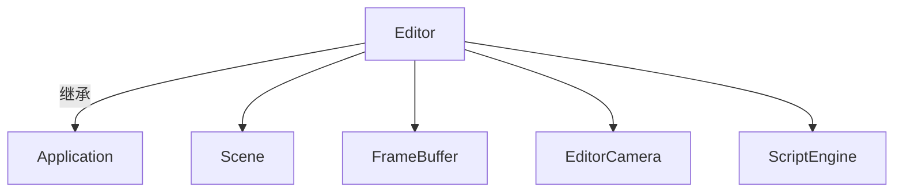

# 编辑器（editor）

路径：`editor/src`，生成可执行程序 `editor`。

## 概览

`Editor` 继承 `Application`，是一个基于 ImGui + ImGuizmo 的 3D 场景编辑器，体验向 Blender / UE 靠拢。

## 结构

- `Editor::Initialize()`：
  1. 创建 `Scene`，设置渲染参数（IBL 强度/曝光/Bloom/阴影半径等）。
  2. 初始化 `EditorCamera`（轨道相机）、`ScriptEngine`（加载 `assets/scripts/test.lua`）。
  3. 初始化 ImGui（docking）与 ImGui 渲染后端。
  4. 创建视口 `FrameBuffer`（离屏渲染到纹理）。
  5. 建立地面网格实体（程序化 grid shader）+ 一个初始立方体。
  6. 设置内容浏览器起始目录（`assets/`）。
- `Editor::OnUpdate(dt)`：每帧渲染 3D 场景到视口 FBO → 解绑 FBO → `BeginImGui()` → 各面板 → `EndImGui()`。

## 面板

| 面板 | 函数 | 说明 |
| --- | --- | --- |
| 菜单栏 | `BeginImGui()` | File（Open 占位）+ View（面板显隐 + Reset Layout） |
| 内容浏览器 | `ShowImGuiContentBrowser()` | 遍历 `assets/` 目录，图片缩略图 + 拖拽源（`CONTENT_BROWSER_ITEM` payload） |
| 视口 | `ShowImGuiViewport()` | 显示视口 FBO 纹理；工具栏（Translate/Rotate/Scale + Play/Stop）；接收模型拖入 |
| 场景层级 | `ShowImGuiScene()` | **父/子层级树**（缩进 + 展开/折叠，子实体随父实体移动/旋转/缩放）；Create（Empty/Cube/Plane/Sphere/Camera）+ Delete（级联删除子树）+ Duplicate（整棵子树深拷贝）；右键节点可 Create Child / Duplicate / Delete / Unparent；**拖拽到另一节点 = 重新父化**，拖到列表下方空区 = 解除父化 |
| 属性 | `ShowImGuiProperties()` | 编辑选中实体：Tag/Transform/Mesh（材质贴图槽 + 因子）/Camera |
| 光照 | `ShowImGuiLighting()` | 方向光 + 点光源列表（增删改） |
| 日志 | 同 | 显示 `mengine.log`，支持 Clear |
| 信息 | `ShowImGuiInformation()` | FPS + 编辑器相机参数 |

## 关键交互

- **视口操控**：右键拖动 = 环绕；中键拖动 = 平移；滚轮 = 缩放。
- **Gizmo**：`W`/`E`/`R` 切换移动/旋转/缩放；`F` 聚焦选中实体；`Ctrl+D` 复制实体。
- **模型导入**：从内容浏览器拖 `.obj` / `.gltf` / `.glb` 到视口，自动取景并落在网格上；OBJ 自动套用同目录贴图（diffuse/normal/roughness/ao）。
- **材质编辑**：在 Properties → Mesh 里把图片拖到 Albedo/Normal/Roughness/AO 缩略图槽，右键清除；可调 Base Color/Metallic/Roughness/Specular。
- **渲染到纹理**：`Scene::RenderMeshes(..., target_fbo=视口FBO, ...)` 合成到视口纹理，`frame_buffer_->Unbind()` 后再交给 ImGui 显示。

## 当前局限

- 场景序列化（`LoadScene/SaveScene`）未实现。
- OBJ 的 `.mtl` 未解析（贴图靠文件名约定自动套用）。
- 模型/场景面板尚无多选、撤销/重做。
- 内容浏览器无面包屑/刷新按钮。
