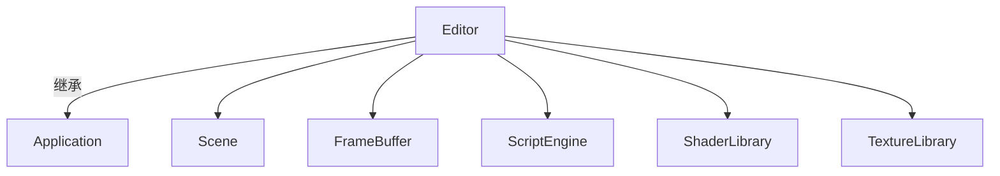

# 编辑器（editor）

路径：`editor/src`，生成可执行程序 `editor`。

## 概览

`Editor` 继承 `Application`，是一个基于 ImGui 的编辑器原型，目标是类似 Blender/UE 的可视化编辑体验（当前为早期雏形）。

## 结构

- `Editor::Initialize()`：
  1. 创建 `Scene`、编辑器相机（`Camera2D`）、`ScriptEngine`（加载 `res/scripts/test.lua`）。
  2. 初始化 ImGui（docking 开启）与 ImGui 渲染后端。
  3. 创建 `FrameBuffer`（离屏渲染到纹理）。
  4. 设置内容浏览器起始目录，加载目录/文件图标。
- `Editor::OnUpdate(dt)`：每帧 `BeginImGui()` → 各面板 → `EndImGui()`，并根据 `game_mode_` 驱动场景（编辑/播放）。

## 面板

| 面板 | 函数 | 说明 |
| --- | --- | --- |
| 菜单栏 | `BeginImGui()` | File 菜单（Open 占位） |
| 内容浏览器 | 同 | 遍历当前目录，缩略图网格 + 拖拽源（`CONTENT_BROWSER_ITEM` payload） |
| 视口 | `ShowImGuiViewport()` | 将 `FrameBuffer` 纹理作为 ImGui Image 显示；Play/Stop 按钮 |
| 场景层级 | `ShowImGuiScene()` | 实体列表 |
| 属性 | `ShowImGuiProperties()` | 编辑选中实体的组件（Tag、Transform、Sprite2D、Camera2D 等） |
| 日志 | 同 | 读取并显示 `mengine.log` |

## 关键交互

- **内容浏览器**：`std::filesystem::directory_iterator` 遍历目录；双击进入子目录；图标用 `ImGui::ImageButton` 显示。
- **渲染到纹理**：场景渲染到 `frame_buffer_`，视口用 `ImGui::Image` 显示 `frame_buffer_->GetTextureId()`。
- **游戏模式**：`GameMode::Edit / Play`，Play 时调用场景运行时更新。
- **组件编辑**：`DisplayAddComponentEntry<T>()` 通过 `ImGui::Popup` 添加组件（Transform/Sprite2D/Camera2D）。

## 当前局限

- 拖拽仅产生 payload，**尚未实现接收端**（拖入场景/资源加载）。
- `Open` 菜单、场景序列化、属性编辑持久化等均为 TODO。
- 编辑器相机是 2D 正交相机；3D 化后需升级为透视 + 轨道相机（orbit camera）。
