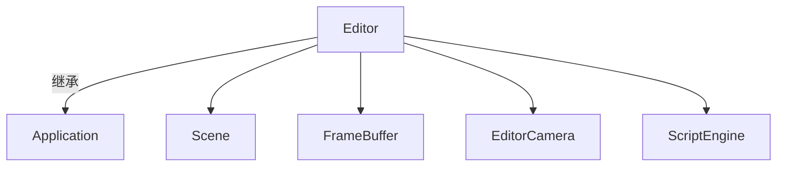

# 编辑器（editor）

路径：`editor/src`，生成可执行程序 `editor`。

## 概览

`Editor` 继承 `Application`，是一个基于 ImGui + ImGuizmo 的场景编辑器（2D / 3D），体验向 Blender / UE / Godot 靠拢。

场景带**维度**（`SceneDimension::Scene2D/Scene3D`，随 `.scene` 文件保存）：3D 场景用
`ShowImGuiViewport()`（轨道/飞行相机 + 3D 渲染），2D 场景用 `ShowImGui2DViewport()`
（正交相机 + `Scene::Render2D`）。两者是独立的视口面板，各自提供匹配自己维度的工具，
不会出现「3D 视口里切 2D」的模式开关。

```mermaid
graph TB
    Editor -->|继承| Application
    Editor --> Scene
    Editor --> FrameBuffer
    Editor --> EditorCamera
    Editor --> ScriptEngine
```

## 结构

- `Editor::Initialize()`：
  1. 创建 `Scene`，设置渲染参数（IBL 强度/曝光/Bloom/阴影半径等）。
  2. 初始化 `EditorCamera`（轨道相机）、`ScriptEngine`（加载 `assets/scripts/test.lua`）。
  3. 初始化 ImGui（docking）与 ImGui 渲染后端。
  4. 创建视口 `FrameBuffer`（离屏渲染到纹理）。
  5. 建立地面网格实体（程序化 grid shader）+ 默认通用引擎光照演示场景 `CreateEngineDemo`（PBR 地板/箱子/金属球 + 太阳阴影 + 彩色点光 + HDR 发光灯泡 bloom）。
  6. 设置内容浏览器起始目录（`assets/`）。
  7. 可选 `--scene <path>`：启动即打开该场景（2D/3D 由文件里的 `dimension` 决定）。
- `Editor::OnUpdate(dt)`：每帧按**场景维度**渲染到视口 FBO（3D = 编辑器相机 + `Scene::RenderMeshes`，
  2D = 正交二维相机 + `Scene::Render2D`；Play 模式两者都交给主相机）→ 解绑 FBO → `BeginImGui()` →
  各面板（`Is2DView()` 决定显示哪个视口面板）→ `EndImGui()`。

## 面板

| 面板 | 函数 | 说明 |
| --- | --- | --- |
| 菜单栏 | `BeginImGui()` | File（Open / Save / Save As…，原生对话框）+ View（面板显隐 + Reset Layout） |
| 内容浏览器 | `ShowImGuiContentBrowser()` | 遍历 `assets/` 目录，图片缩略图 + 拖拽源（`CONTENT_BROWSER_ITEM` payload） |
| 视口（3D） | `ShowImGuiViewport()` | 3D 场景用：显示视口 FBO 纹理；工具栏（Fly/Orbit + Play/Stop + Launch）；接收模型拖入 |
| 视口（2D） | `ShowImGui2DViewport()` | 2D 场景用（**独立面板**，标题 `2D Viewport`）：工具栏（Play/Stop + **Sprite** 新建精灵 + Frame All 取景 + Launch + 操作提示）；中键平移 / 滚轮缩放；把图片从内容浏览器拖进来 = 用该贴图新建精灵；ImGuizmo 走正交模式 |
| 场景层级 | `ShowImGuiScene()` | **父/子层级树**（缩进 + 展开/折叠，子实体随父实体移动/旋转/缩放）；Create（Empty/Cube/Plane/Sphere/Camera）+ Delete（级联删除子树）+ Duplicate（整棵子树深拷贝）；右键节点可 Create Child / Duplicate / Delete / Unparent；**拖拽到另一节点 = 重新父化**，拖到列表下方空区 = 解除父化 |
| 时间轴 | `ShowImGuiTimeline()` | **关键帧动画（对齐 Godot/Unity/UE 习惯）**：Play/Pause/Stop + Loop + Auto-Key；可设置 **Length(时长)**；可拖/可输入的 **playhead**；下方是**时间标尺 + T/R/S 三条关键帧轨道**——在标尺/轨道上点击拖动 = 移动 playhead，**菱形关键帧可左右拖动改时间**，点击选中后在下方 inspector 编辑 time / xyz / 删除；顶部 Key Translation/Rotation/Scale 在当前 playhead 记录当前位姿；Play 模式自动从 t=0 播放（时长/loop 持久化到场景） |
| 属性 | `ShowImGuiProperties()` | 编辑选中实体：Tag/Transform/Mesh（材质贴图槽 + 因子）/Model（part 下拉逐部位材质）/Camera/**Sprite（2D）**（贴图缩略图拖拽、tint、size、**tiling**、flip、sorting layer / order、`uv_rect`、Whole Texture、Fit 32 px/unit、**Tile at 32 px/unit**）/**Sprite Animation（2D）**（columns/rows、first frame、frame count、fps、loop、ping-pong、playing、**Play While Moving**、Scrub）/Lua Script |
| 光照 | `ShowImGuiLighting()` | **ECS 实体灯统一管理**：方向光实体可多个（首个＝带阴影主光，其余＝无阴影补光；无实体时退到 Scene Sun 兜底）+ 点/聚光实体列表（Add / 点击选中），数值在 Properties 编辑；视口常显光源示意图（每个方向光各一个太阳箭头 / 灯泡 / 锥体） |
| 日志 | 同 | 显示 `mengine.log`，支持 Clear |
| 信息 | `ShowImGuiInformation()` | FPS + 编辑器相机参数 |

## 关键交互

- **视口操控**：右键拖动 = 环绕；中键拖动 = 平移；滚轮 = 缩放。（2D 视口只有中键平移 + 滚轮缩放，
  无轨道/飞行——二维视图没有可以绕的轴。）
- **2D 工作流**：File → New 2D Scene 新建（自动建正交主相机 + 平铺棋盘背景 + **狐狸精灵**
  `textures/qoguldsd.png`（6 帧走路循环，`play_while_moving`，附 `scripts/fox_controller.lua`：
  Play 模式下 WASD/方向键控制，**只在移动时播放、松手立即停在待机帧**）+ 静态精灵）；
  Create → Sprite 或 2D 视口工具栏的 **Sprite** 新建精灵；Info 面板的 Editor Camera 在 2D 下改成
  `Center (X/Y)` + `Zoom size`；Scene 面板里 `Sprite (2D)` / `Sprite Animation (2D)` 组件按需添加。
  **2D 场景里的精灵动画在编辑态就会播**（每帧 `Scene::UpdateSpriteAnimations`，走路循环则保持待机帧）。
- **Gizmo**：`W`/`E`/`R` 切换移动/旋转/缩放；`F` 聚焦选中实体；`Ctrl+D` 复制实体。
- **光源方向 = 实体旋转**：选中 Directional / Spot 光实体按 `E` 旋转，光轴（局部 -Z）即传播/照射方向；新建方向/聚光默认朝下（pitch -90°）。**多方向光**：场景里第一个方向光实体是带阴影主光，可再添加多个方向光实体作为无阴影补光（各自 Color 在 Properties 调，旋转即可瞄准）。
- **模型导入**：从内容浏览器拖 `.obj` / `.gltf` / `.glb` 到视口，自动取景并落在网格上；OBJ 有 `.mtl` 时按 `.mtl` 读取贴图与 `Kd`，否则按文件名约定自动套用同目录贴图（diffuse/normal/roughness/ao）。**多材质 OBJ**（如 nanosuit）导入为**单个实体**的 ModelComponent——六个 `usemtl` 部位各自贴图，整体随实体 Transform 移动/缩放。
- **材质编辑**：在 Properties → Mesh / Model 里把图片拖到 Albedo/Normal/Roughness/AO 缩略图槽，右键清除；可调 Base Color/Metallic/Roughness/Specular。Model 用 Part 下拉选部位后逐部位编辑。**视差**：下方 Height 缩略图拖高度图 + Height Scale 滑条（POM 视差遮挡映射，pbr/blinn 材质有效）。
- **渲染到纹理**：`Scene::RenderMeshes(..., target_fbo=视口FBO, ...)` 合成到视口纹理，`frame_buffer_->Unbind()` 后再交给 ImGui 显示。

## 当前局限

- 模型/场景面板尚无多选、撤销/重做。
- 内容浏览器无面包屑/刷新按钮。
- 一个场景只能是 2D 或 3D（与 Unity/Godot 的模板一致）：2D 场景走精灵通道，
  `MeshComponent` / `ModelComponent` 不会被绘制（3D 内容需要在 3D 场景里做）；
  2D 视口没有网格吸附/对齐辅助线。
- 尚无 tilemap 工具（地砖目前是普通的精灵实体，可以框选/复制但需要逐块摆放）。
