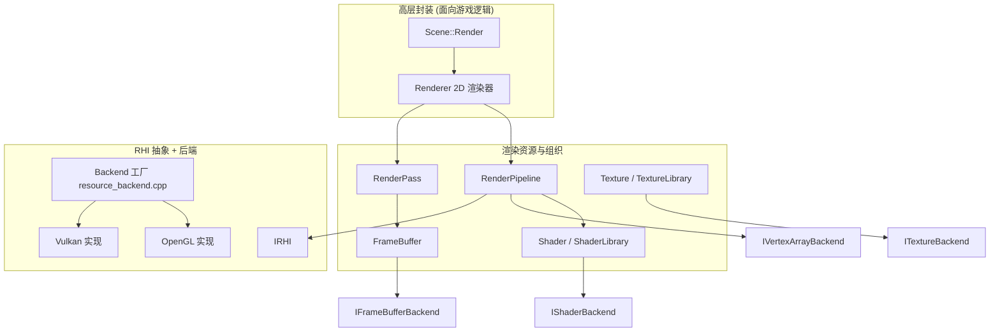

# 渲染层（render）

路径：`engine/src/render`，RHI 抽象在 `engine/src/render/rhi`。

## 层次划分



## 高层封装

### Renderer（2D 渲染器）
- 构造时创建：一个四边形 VAO（顶点含 `aPos`(vec3) + `aTexCoord`(vec2)，索引缓冲 6 个），加载默认 shader（`res/shaders/default_{vert,frag}.glsl`），并组装一个 `RenderPipeline`。
- 提供 `RenderSprite(Sprite2D&)` 与 `RenderSprite(AnimatedSprite2D&)`：
  1. 绑定 shader 与 texture（无纹理时生成 1×1 纯色纹理）。
  2. 设置 `model`、`proj_view`、`texture1` uniform。
  3. `pipeline_->Execute()` 绘制。
- ⚠️ 当前是 **2D 专用**：VAO 硬编码为四边形、shader 硬编码为 2D 默认 shader，无 Mesh/模型概念。3D 化需要重构（见 roadmap）。

### RenderPipeline
- 一个绘制单元 = `IVertexArrayBackend`（几何）+ `Shader`（着色器）。
- `Execute()`：绑定 shader → 绑定 VAO → `rhi->DrawIndexedTriangles(count)` → 解绑。

### RenderPass
- 持有离屏帧缓冲（`fb_`）与若干 `RenderPipeline`。
- `Begin()` 绑定 FBO 并清屏；`End()` 解绑回默认帧缓冲；`Execute()` 依次执行所有 pipeline。
- 帧缓冲 id 由 `IRHI::CreateFramebuffer()` 创建。

### RenderContext（疑似重复抽象）
- 与 `RenderPass` 几乎一致（持 FBO + pipelines），但**未被使用**。3D 化时可合并或删除。

## 资源类（Backend 模式）

每个资源类都是「高层包装 + 后端指针」结构，后端通过工厂创建：

| 高层类 | 后端接口 | OpenGL 实现 | Vulkan 实现 |
| --- | --- | --- | --- |
| `Shader` | `IShaderBackend` | `OpenGLShaderBackend`（编译 GLSL，`program_`） | `VulkanShaderBackend`（**空壳**，只缓存矩阵） |
| `Texture` | `ITextureBackend` | `OpenGLTextureBackend`（`glGenTextures`） | `VulkanTextureBackend`（**CPU 端缓存像素**） |
| `FrameBuffer` | `IFrameBufferBackend` | `OpenGLFrameBufferBackend`（FBO+纹理+渲染缓冲） | `VulkanFrameBufferBackend`（**空壳**） |
| （VAO） | `IVertexArrayBackend` | `OpenGLVertexArrayBackend`（VAO/VBO/IBO） | `VulkanVertexArrayBackend`（**CPU 端缓存顶点/索引**） |

工厂函数在 `resource_backend.cpp`：

```cpp
std::unique_ptr<ITextureBackend> CreateTextureBackend();
std::unique_ptr<IShaderBackend>  CreateShaderBackend(vert, frag);
std::unique_ptr<IFrameBufferBackend> CreateFrameBufferBackend(w, h);
std::unique_ptr<IVertexArrayBackend> CreateVertexArrayBackend();
```

它们根据 `GetActiveRHI()->GetAPI()` 选择实现。

### Shader
- 加载 GLSL 顶点/片元源码，`SetUniform{Int,Float,Vec2,Vec3,Vec4,Mat4}` 封装 uniform 设置。
- `ShaderLibrary`：`Add/Load/Get/Exists`，按 name 管理（用于编辑器资产管理）。

### Texture
- 通过 `stb_image` 加载（`STB_IMAGE_IMPLEMENTATION` 在 `texture.cpp`）。
- 支持静态纹理与 SpriteSheet 子纹理（`SetSubTexture` / `h_frames` / `v_frames`）。
- `TextureLibrary`：按 name 管理纹理。

### FrameBuffer
- 离屏渲染目标（默认 1600×900，TODO：可配置）。
- `AttachTexture / AttachRenderBuffer / CheckStatus / Clear / Resize / GetTextureId`。

## RHI 抽象（IRHI）

`engine/src/render/rhi/rhi.hpp`：

```cpp
class IRHI {
  virtual GraphicsAPI GetAPI() const = 0;
  virtual void SetupWindowHints() const = 0;
  virtual bool Initialize(GLFWwindow*) = 0;
  virtual void BeginFrame(const glm::vec4& clear_color) const = 0;
  virtual void EndFrame(GLFWwindow*) const = 0;
  virtual bool InitializeImGuiBackend(GLFWwindow*) = 0;
  virtual void ShutdownImGuiBackend() const = 0;
  virtual void BeginImGuiFrame() const = 0;
  virtual void RenderImGuiDrawData(ImDrawData*) const = 0;
  virtual void DrawIndexedTriangles(int index_count) const = 0;
  virtual unsigned int CreateFramebuffer() const = 0;
  virtual void DestroyFramebuffer(unsigned int) const = 0;
  virtual void BindFramebuffer(unsigned int) const = 0;
  virtual void ClearBoundFramebufferColor(const glm::vec4&) const = 0;
};
```

工厂：`CreateRHI(GraphicsAPI)`，另有 `SetActiveRHI` / `GetActiveRHI` 管理当前后端（单例式指针）。

### OpenGLRHI
- `SetupWindowHints`：请求 OpenGL 4.6 core。
- `Initialize`：`glfwMakeContextCurrent` + `gladLoadGLLoader`。
- ImGui 后端：`imgui_impl_opengl3`。

### VulkanRHI（部分实现）
- 有 instance / surface / device / swapchain 等初始化代码（`CreateInstance`、`CreateSwapchain` 等）。
- 编译开关：`MENGINE_HAS_VULKAN`（CMake 在找到 Vulkan SDK 时定义）。
- 未定义时，`Initialize` 打日志并返回 false，`CreateRHI` 回退到 OpenGL。
- ⚠️ 资源后端（Texture/Shader/FrameBuffer/VAO）均为空壳，因此 **Vulkan 路径目前无法真正渲染**，处于实验状态。

## 着色器资源

- `sandbox/res/shaders/default_vert.glsl`（`#version 460`）：输入 `aPos`/`aTexCoord`，uniform `model`/`proj_view`，输出 `TexCoord`。
- `sandbox/res/shaders/default_frag.glsl`：`texture(texture1, TexCoord)`。

## 当前渲染局限

1. **仅 2D**：无 Mesh / 3D 模型 / 深度光照管线。
2. **Vulkan 未完成**：后端空壳，无真实 GPU 资源。
3. **RenderContext 重复**：与 RenderPass 冗余。
4. **资源加载路径写死**：默认 shader 路径硬编码在 Renderer 构造中。
5. **无渲染图（Render Graph）/ 无自动资源生命周期管理**。
