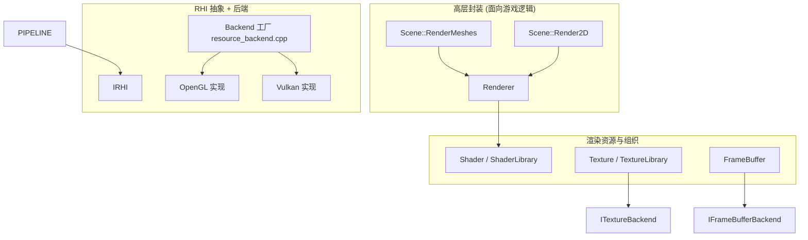
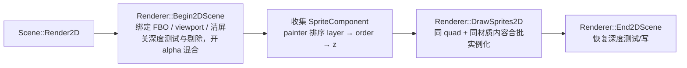

# 渲染层（render）

路径：`engine/src/render`，RHI 抽象在 `engine/src/render/rhi`。

> 说明：渲染器已从 2D 精灵管线重构为 **Mesh 驱动的 PBR 管线**（阴影/IBL/SSAO/体积光/TAA），
> 3D 是当前主路径。着色器与资源集中在 `assets/shaders` / `assets/textures` / `assets/models`
> （由 `AssetManager` + `manifest.json` 管理）；下文部分历史小节中出现的 `res/shaders` 等路径
> 是重构前的旧布局，仅作历史记录。

## ⚠️ 最新（M6 / LearnOpenGL 移植期）

下文 M1–M4 是**演进史**，部分“已知限制”已被 M6 解决。当前渲染层的最新能力请以
`docs/status.md` 的 **M6** 小节为准，示例层面的 1:1 复刻清单见 `examples/PORTING.md`。M6 期间新增：

- **三套 fragment 管线**：`pbr`（引擎 PBR GGX，默认）、`blinn`（经典 Blinn-Phong）、
  `blinn_lo`（LO-exact：逐灯 ambient/diffuse/specular + Phong/Blinn 高光 + specular 贴图）。
- **后期 tone 模式**：默认 ACES+gamma；`SetLinearOutput`（raw clamp）、`SetLoHdrTone`
  （`1-exp(-x)`+gamma）、`SetReinhardTone`（`color/(color+1)`+gamma）。
- **split-sum BRDF LUT**（`Skybox::GenerateBRDF`/`BindBRDF`，单元 13）替代旧简化镜面 IBL；
  `Scene::SetIblSpecular(bool)` 提供“仅漫反射 IBL”模式（LO 6.pbr/2.1.2）。
- **环境 HDR 逐应用覆盖 + 翻转**（`Application::SetEnvironmentHdrPath/Flip`）。
- 材质 `SetAlbedoSRGB` / `SetSpecularMap` / `SetSpecularColor` / 合并 MR 贴图等。
- **背面剔除已按材质启用**（`rhi->SetCullMode(material->GetCullMode())`，默认 Back）。

## 层次划分


```mermaid
graph TB
    subgraph 高层["高层封装 (面向游戏逻辑)"]
        RENDERER[Renderer]
        SCENE3D[Scene::RenderMeshes]
        SCENE2D[Scene::Render2D]
    end

    subgraph 中间层["渲染资源与组织"]
        SHADER[Shader / ShaderLibrary]
        TEX[Texture / TextureLibrary]
        FB[FrameBuffer]
    end

    subgraph RHI层["RHI 抽象 + 后端"]
        IRHI[IRHI]
        FACTORY[Backend 工厂 resource_backend.cpp]
        GL[OpenGL 实现]
        VK[Vulkan 实现]
    end

    RENDERER --> SHADER
    SCENE3D --> RENDERER
    SCENE2D --> RENDERER
    TEX --> ITextureBackend
    FB --> IFrameBufferBackend
    FACTORY --> GL
    FACTORY --> VK
    PIPELINE --> IRHI
```

## 高层封装

### Renderer
- 3D 主路径的“阶段式”接口：`BeginShadowPass` / `DrawMeshShadowInstanced` / `BeginSSAOPass` /
  `DrawMeshSSAOInstanced` / `DrawMeshInstanced` / `Skybox` / `PostProcess`，由 `Scene::RenderMeshes`
  按 阴影 → 点光阴影 → SSAO → 主 pass（HDR FBO）→ 天空盒 → 后处理合成 的顺序驱动。
- 资源：默认 1×1 白纹理、方向光 shadow map、点光 cube shadow map（`kMaxPointShadows`）、
  `SSAO`、`Skybox/IBL`、`PostProcessing`（HDR + bloom + god rays + TAA + tone）。
- `BeginShadowPass`/`BeginPointShadowPass` 负责绑定对应的 FBO + 深度着色器；其它阶段（SSAO/主
  pass/后处理）由各自的子模块用原始 GL 绑定 FBO/设置 viewport，Renderer 只做转发。
- 材质/场景 uniform（`proj_view`、`view_pos`、`base_color_factor`、贴图槽、灯光、shadow map、
  IBL）在 `DrawMeshInstanced` 内按 shader 缓存上传一次。

### Renderer 的 2D 通道（`Begin2DScene` / `DrawSprites2D` / `End2DScene`）
- 见下文「2D 场景」一节：2D 不复用任何 3D 阶段，三个调用即是一整帧。

> 历史：`RenderPipeline` / `RenderPass` / `RenderContext` / `core/command.hpp` 这套 2D 时代的
> 绘制抽象已删除（Renderer 直接调 RHI + 子模块，见上）。`RenderContext` 当时就未被使用。

## 资源类（Backend 模式）

每个资源类都是「高层包装 + 后端指针」结构，后端通过工厂创建：

| 高层类 | 后端接口 | OpenGL 实现 | Vulkan 实现 |
| --- | --- | --- | --- |
| `Shader` | `IShaderBackend` | `OpenGLShaderBackend`（编译 GLSL，`program_`） | `VulkanShaderBackend`（**空壳**，只缓存矩阵） |
| `Texture` | `ITextureBackend` | `OpenGLTextureBackend`（`glGenTextures`） | `VulkanTextureBackend`（**CPU 端缓存像素**） |
| `FrameBuffer` | `IFrameBufferBackend` | `OpenGLFrameBufferBackend`（FBO+纹理+渲染缓冲） | `VulkanFrameBufferBackend`（**空壳**） |
| （VAO） | `IVertexArrayBackend` | `OpenGLVertexArrayBackend`（VAO/VBO/IBO） | `VulkanVertexArrayBackend`（**CPU 端缓存顶点/索引**） |

工厂函数在 `resource_backend.cpp`：

```cpp
std::unique_ptr<ITextureBackend> CreateTextureBackend();
std::unique_ptr<IShaderBackend>  CreateShaderBackend(vert, frag);
std::unique_ptr<IFrameBufferBackend> CreateFrameBufferBackend(w, h);
std::unique_ptr<IVertexArrayBackend> CreateVertexArrayBackend();
```

它们根据 `GetActiveRHI()->GetAPI()` 选择实现。

### Shader
- 加载 GLSL 顶点/片元源码，`SetUniform{Int,Float,Vec2,Vec3,Vec4,Mat4}` 封装 uniform 设置。
- `ShaderLibrary`：`Add/Load/Get/Exists`，按 name 管理（用于编辑器资产管理）。

### Texture
- 通过 `stb_image` 加载（`STB_IMAGE_IMPLEMENTATION` 在 `texture.cpp`）。
- 支持静态纹理与 SpriteSheet 子纹理（`SetSubTexture` / `h_frames` / `v_frames`）。
- `TextureLibrary`：按 name 管理纹理。

### FrameBuffer
- 离屏渲染目标（默认 1600×900，TODO：可配置）。
- `AttachTexture / AttachRenderBuffer / CheckStatus / Clear / Resize / GetTextureId`。

## Mesh 与 3D 网格（M1 新增）

- `Vertex`（`render/vertex.hpp`）：交错顶点 = position(vec3) + normal(vec3) + texcoord(vec2)，`GetLayout()` 返回与内存布局一致的属性描述。
- `Mesh`（`render/mesh.hpp/.cpp`）：
  - 复用 `IVertexArrayBackend`（`CreateVertexArrayBackend()`）作为几何后端，**未新增后端接口**，Vulkan 复用已有空壳。
  - 保留 CPU 端顶点/索引副本，供重上传/导出/拾取使用。
  - `Mesh::CreateCube(size)`：24 顶点 + 36 索引的单位立方体（每面独立法线与 UV）。
- `Renderer::DrawMesh(mesh, shader, texture, model, proj_view, view_pos)`：绑定 shader/texture → 设置 uniform → `DrawIndexedTriangles`；无纹理时使用 1×1 白色兜底纹理。
- `Scene::RenderMeshes(proj_view, camera_pos)`：遍历带 `MeshComponent` 的实体，结合 `Transform` 计算 model 矩阵后绘制。

## 模型导入

- `ModelLoader`（`render/model_loader.hpp/.cpp` + `render/gltf_loader.cpp`）：加载模型文件为 `Mesh`。
  - **Wavefront OBJ**：`v` / `vt` / `vn` / `f`（含 `v/vt`、`v//vn`、`v/vt/vn` 三种形式）、多边形扇形三角化、负索引；文件缺 `vn` 时自动生成平面面法线。
  - **glTF 2.0**（`.gltf` / `.glb`，基于 tinygltf）：取第一个 mesh 的第一个 primitive，使用 POSITION / NORMAL（缺时生成平面法线）/ TEXCOORD_0 属性；`LoadGltfBaseColorTexture` 可提取第一份材质的 baseColor 贴图。
  - 返回 `nullptr` 表示加载失败。
- 依赖：`deps/tinygltf/tiny_gltf.h` + `deps/nlohmann/json.hpp`（vendored 单头文件，MIT）。
- `MeshLibrary`（`mesh.hpp`）：按名字缓存 `Mesh`，与 `ShaderLibrary`/`TextureLibrary` 对齐。多材质 `Model` 的 part 网格即用其缓存（键 `"模型路径|材质组"`），同一模型多次导入/多实体共享同一份 GPU 网格并合批。
- **单实体多材质 `Model`**（`render/model_loader.hpp`）：`Model`/`ModelPart`（每 part = mesh + 材质 + 名）；`LoadObjModel` 按 OBJ `usemtl` 拆成多 part。实体通过 `ModelComponent` 携带，`Scene::RenderMeshes` 在同一实体 Transform 下把每 part 展开为渲染项（阴影/SSAO/主 pass/合批与 MeshComponent 一致）。
- 示例资源：`sandbox/res/models/sphere.obj`（由 `tools/gen_sphere.py` 生成）、`sandbox/res/models/duck.glb`（Khronos glTF 样例）。
- 后续扩展点：Assimp 多格式、glTF 多网格节点树。

## 材质与光照（M3a 新增）

- `Material`（`render/material.hpp`）：glTF metallic-roughness PBR 材质，持有 albedo / normal / metallic-roughness / AO 四张贴图及 baseColor/metallic/roughness 因子，由 `Renderer::DrawMesh` 负责绑定与 uniform 上传。
- `MeshComponent` 现在绑定 `Mesh + Material`（取代了之前的 `shader + texture`）。
- PBR shader：`res/shaders/pbr_{vert,frag}.glsl`——Cook-Torrance GGX 微面元 BRDF + 方向光 + 环境光，支持法线贴图（导数法 TBN，无需切线属性）、金属/粗糙度、AO，以及 Reinhard tone mapping + gamma 校正。
- **视差遮挡映射（POM）**：pbr/blinn 片段着色器带 LO 5.3 风格 POM——`Material` 可选 height map（红通道）+ `height_scale`（渲染单元 15 绑定、逐 draw 上传）；沿切线空间视线分层 ray-march + 层间插值位移 UV（导数法几何 TBN，无需切线属性）。有高度图且 `height_scale>0` 时生效；高度图 + scale 参与合批比较与场景序列化往返。
- glTF 加载器新增 `ModelLoader::LoadGltfMaterial`，提取 PBR 贴图与因子。
- 样例：`sandbox/res/models/damaged_helmet.glb`（Khronos PBR 测试模型）。

## 阴影映射（M3b 新增）

- `DirectionalLight`（`render/light.hpp`）：方向光（direction/color），`GetLightSpaceMatrix` 生成正交光照空间矩阵。
- `ShadowMap`（`render/shadow_map.hpp/.cpp`）：深度贴图 + FBO（2048×2048，GL_DEPTH_COMPONENT），OpenGL 专属（待 Vulkan 后端抽象）。
- 渲染流程（`Scene::RenderMeshes`）：
  1. 阴影 pass：用 depth-only shader（`shadow_depth_{vert,frag}.glsl`）从光视角渲染所有网格到阴影贴图。
  2. 主 pass：PBR shader 采样阴影贴图（`ShadowCalculation`，带 bias），对直接光乘以阴影因子。
- `Renderer` 持有 `ShadowMap` + depth shader + `DirectionalLight`，提供 `BeginShadowPass/DrawMeshShadow/EndShadowPass`。

## 多光源（M3c 新增）

- `PointLight`（`render/light.hpp`）：点光源（position/color/intensity/radius，距离衰减）。
- `Renderer` 维护点光源列表（`AddPointLight/ClearPointLights`），`Scene` 透传。
- PBR shader 用 uniform 数组（`point_light_positions/colors/intensities/radii`，上限 8），对每个点光源累加 Cook-Torrance 贡献（距离平方衰减 + radius 软截止）。
- 方向光保留阴影；点光源暂不投影阴影。

## 软阴影 + 点光阴影 + 聚光（M3d 新增）

- **PCF 软阴影**：方向光阴影采样改为 3×3 百分比渐近滤波（`shadow_map_size` uniform），边缘柔化。
- `CubeShadowMap`（`render/cube_shadow_map.hpp/.cpp`）：立方体深度贴图 + FBO（1024×1024），逐面附着 + 清除。
- `PointLight` 新增 `casts_shadow` + `GetShadowMatrices()`（6 面 90° 透视视图投影）；点光阴影 pass 用 `point_shadow_depth_{vert,frag}.glsl` 写入归一化距离（`gl_FragDepth`）。
- PBR shader 用 `texture(point_light_shadow_maps[i], fragToLight)` 采样点光阴影（带距离 bias）；`Renderer::kMaxPointShadows = 4`。
- `SpotLight`（position/direction/range/cutoff/outer_cutoff）；PBR shader 聚光贡献（内外锥 `clamp((theta - outer) / (cutoff - outer))` 平滑衰减）。
- 流程（`Scene::RenderMeshes`）：方向光阴影 pass → 点光 cube shadow passes（逐面） → 主 pass → 天空盒 → 后处理。
- 已知限制：点光阴影无 PCF、聚光无阴影；`CubeShadowMap` 为 OpenGL 专属。

## HDR 与后处理（M4a 新增）

- `PostProcessing`（`render/post_processing.hpp/.cpp`）：HDR 渲染目标（RGBA16F）+ bloom。
- 流程（`Scene::RenderMeshes`）：阴影 pass → 主 pass 渲染到 HDR 帧缓冲（`BeginScene/EndScene`）→ `PostProcess()` 做 brightness 提取 + 高斯模糊（ping-pong）+ 合成（ACES tone mapping + gamma）。
- PBR shader 改为输出 **HDR 线性**（tone mapping/gamma 移到后处理）。
- 相关 shader：`post_vert.glsl`（全屏三角形）、`brightness_frag.glsl`、`blur_frag.glsl`（双 pass 高斯）、`composite_frag.glsl`（ACES）。
- OpenGL 专属（同 ShadowMap），待 Vulkan 后端抽象。

## 天空盒与 IBL（M4b 新增）

- `Skybox`（`render/skybox.hpp/.cpp`）：从 6 张 face 图像（right/left/top/bottom/front/back）构建 `GL_TEXTURE_CUBE_MAP`（`GL_SRGB8_ALPHA8` + mipmap），计算 `max_mip_level = log2(face_size)`。
- 背景渲染：`Render(view, proj)` 用 `glDepthFunc(GL_LEQUAL)` + `glDepthMask(GL_FALSE)`，vertex shader 中去平移（`glm::mat3(view)`）并输出 `pos.xyww`（`gl_Position = pos.xyww`）使天空盒深度落在最远端。
- 辐射照度预计算：`GenerateIrradiance()` 用 capture FBO 依次渲染 6 个面，把环境贴图经半球卷积烘焙为 32×32 irradiance cubemap（`RGBA16F`）。
- `Renderer::DrawMesh` 绑定环境贴图（slot 5）+ 辐射照度贴图（slot 6），上传 `environment_map/irradiance_map/max_mip_level`。
- PBR shader IBL：漫反射 `texture(irradiance_map, N)`；镜面 `textureLod(environment_map, R, roughness * max_mip_level)`；新增 `FresnelSchlickRoughness`。
- `Scene::RenderMeshes(view, proj, camera_pos)`：主 pass 之后调用 `RenderSkybox(view, proj)`。
- 相关 shader：`skybox_{vert,frag}.glsl`、`irradiance_frag.glsl`。
- 资源：`sandbox/res/textures/skybox/`（learnopengl.com 6 面天空盒，LDR JPEG）。
- 已知限制：无 HDR（`.hdr`）加载、无 GGX 预过滤镜面卷积、irradiance 为均匀半球采样；`Skybox` 为 OpenGL 专属。

## HDR 环境 + 预过滤镜面 IBL（M4c 新增）

- `Skybox` 改为从等距柱状 HDR 加载：`stbi_loadf` 读入浮点 HDR → `GL_RGBA16F` 2D 纹理 → `equirect_to_cube_frag.glsl` 转成 512×512 环境立方体贴图（`GenerateEnvironment`）。
- 预过滤镜面卷积（`GeneratePrefilter` + `prefilter_frag.glsl`）：Hammersley 低差异序列 + GGX 重要性采样，把环境立方体贴图烘焙为 128×128、5 级 mip 的 prefiltered cubemap，每级 mip 对应一个粗糙度（0 / 0.25 / 0.5 / 0.75 / 1.0）。
- PBR shader 镜面 IBL 改为 `textureLod(prefiltered_map, R, roughness * max_prefilter_mip)`。
- `Renderer::DrawMesh` 绑定 `irradiance_map`（slot 5）+ `prefiltered_map`（slot 6）。
- 新增 shader：`equirect_to_cube_frag.glsl`、`prefilter_frag.glsl`。
- 资源：`res/textures/hdr/kloppenheim_06_puresky_1k.hdr`（Poly Haven CC0）。
- 已知限制：`Skybox` 为 OpenGL 专属（镜面 BRDF LUT 已在 M6 补齐，见顶部“最新”）。

## SSAO（M4d 新增）

- `SSAO`（`render/ssao.hpp/.cpp`）：几何 pass 用 MRT 写 G-buffer（视图空间 position + normal，RGBA16F），全屏 pass 用 64 个切空间半球样本 + 4×4 随机旋转噪声估计遮蔽，最后 4×4 box blur 去噪。
- 流程（`Scene::RenderMeshes`）：方向光阴影 → 点光 cube 阴影 → **SSAO 几何 pass + AO 生成** → 主 pass → 天空盒 → 后处理。
- PBR shader：`ssao = texture(ssao_map, gl_FragCoord.xy / textureSize(...))`，只乘进 ambient 项（`ambient *= ssao`），不影响直接光。
- 新增 shader：`ssao_geometry_{vert,frag}.glsl`、`ssao_{vert,frag}.glsl`、`ssao_blur_frag.glsl`。
- 已知限制：无 resize 处理、全分辨率 64 样本无优化；`SSAO` 为 OpenGL 专属。

## 体积光 / God Rays（M4e 新增）

- 后处理新增 god rays pass（`god_rays_frag.glsl`）：从方向光太阳的屏幕位置做径向模糊（累加场景亮部，decay/density/weight 控制衰减），形成光柱。
- `composite_frag.glsl` 在 ACES tone mapping 之前叠加 `god_rays * god_rays_strength`。
- `Renderer::PostProcess(view, proj)` 把 `-light.direction`（太阳方向）投影到屏幕空间作为光源。
- `Renderer`/`Scene` 新增 `SetGodRaysStrength`。
- 已知限制：屏幕空间径向模糊（无深度遮挡/真正体积雾）；god rays 为半分辨率、构造时尺寸。

## TAA（M4f 新增）

- 每帧用 Halton(2,3) 低差异序列给相机投影加亚像素抖动（`PostProcessing::GetJitter` + `Renderer::GetJitteredProjection`，`proj[2][0]/[2][1]` 偏移）。
- `taa_frag.glsl`：`mix(history, current, blend)`，并对历史颜色做邻域 AABB 截钳抑制鬼影；`blend` 首帧为 1.0，之后为 0.1。
- `PostProcessing::ResolveTAA` 用双缓冲（ping-pong）维护历史；主 pass 后解析，bloom/god rays/合成采样解析后的纹理（`GetSceneColorTexture`）。
- `Renderer`/`Scene` 新增 `SetTAAEnabled`。
- 已知限制：无运动向量（快速运动可能鬼影）；历史纹理为构造时尺寸。

## RHI 抽象（IRHI）

`engine/src/render/rhi/rhi.hpp`：

```cpp
class IRHI {
  virtual GraphicsAPI GetAPI() const = 0;
  virtual void SetupWindowHints() const = 0;
  virtual bool Initialize(GLFWwindow*) = 0;
  virtual void BeginFrame(const glm::vec4& clear_color) const = 0;
  virtual void EndFrame(GLFWwindow*) const = 0;
  virtual bool InitializeImGuiBackend(GLFWwindow*) = 0;
  virtual void ShutdownImGuiBackend() const = 0;
  virtual void BeginImGuiFrame() const = 0;
  virtual void RenderImGuiDrawData(ImDrawData*) const = 0;
  virtual void DrawIndexedTriangles(int index_count) const = 0;
  virtual unsigned int CreateFramebuffer() const = 0;
  virtual void DestroyFramebuffer(unsigned int) const = 0;
  virtual void BindFramebuffer(unsigned int) const = 0;
  virtual void ClearBoundFramebufferColor(const glm::vec4&) const = 0;
};
```

工厂：`CreateRHI(GraphicsAPI)`，另有 `SetActiveRHI` / `GetActiveRHI` 管理当前后端（单例式指针）。

### OpenGLRHI
- `SetupWindowHints`：请求 OpenGL 4.6 core。
- `Initialize`：`glfwMakeContextCurrent` + `gladLoadGLLoader`。
- ImGui 后端：`imgui_impl_opengl3`。

### VulkanRHI（部分实现）
- 有 instance / surface / device / swapchain 等初始化代码（`CreateInstance`、`CreateSwapchain` 等）。
- 编译开关：`MENGINE_HAS_VULKAN`（CMake 在找到 Vulkan SDK 时定义）。
- 未定义时，`Initialize` 打日志并返回 false，`CreateRHI` 回退到 OpenGL。
- ⚠️ 资源后端（Texture/Shader/FrameBuffer/VAO）均为空壳，因此 **Vulkan 路径目前无法真正渲染**，处于实验状态。

## 着色器资源

- `sandbox/res/shaders/default_vert.glsl`（`#version 460`）：输入 `aPos`/`aTexCoord`，uniform `model`/`proj_view`，输出 `TexCoord`。
- `sandbox/res/shaders/default_frag.glsl`：`texture(texture1, TexCoord)`。
- `sandbox/res/shaders/lit_vert.glsl`（M1 新增）：输入 `aPos`/`aNormal`/`aTexCoord`，输出世界空间 `FragPos`/`Normal`，计算法线矩阵。
- `sandbox/res/shaders/lit_frag.glsl`（M1 新增）：Blinn-Phong 方向光 + 可选纹理（`has_texture`）+ 镜面高光。

## 2D 场景（SceneDimension::Scene2D）

2D 不是“3D 相机换成正交”，而是**另一条渲染路径**：`Scene` 带维度
（`SceneDimension::Scene2D/Scene3D`，随场景文件序列化），维度为 2D 时
`Scene::RenderFromPrimaryCamera` 走 `Scene::Render2D`，**完全不经过**阴影/点光阴影/SSAO/HDR/天空盒/
后处理，只做「一次清屏 + 若干 instanced 批次」，因此 2D 场景的一帧开销与 3D 阶段无关，像素级等于
美术图（不做 tone mapping / gamma 二次变换）。


```mermaid
graph LR
    S[Scene::Render2D] --> B[Renderer::Begin2DScene<br/>绑定 FBO / viewport / 清屏<br/>关深度测试与剔除，开 alpha 混合]
    B --> L[收集 SpriteComponent<br/>painter 排序 layer → order → z]
    L --> D[Renderer::DrawSprites2D<br/>同 quad + 同材质内容合批实例化]
    D --> E[Renderer::End2DScene<br/>恢复深度测试/写]
```

- **组件**：`SpriteComponent`（texture / tint / `uv_rect` / size / `tiling` / flip / sorting_layer / order_in_layer，
  `GetQuad()` 按 `uv_rect+flip+tiling` 缓存单位四边形，`GetMaterial()` 按 texture+tint 缓存材质）+
  `SpriteAnimationComponent`（`SpriteSheet` 网格逐帧推进 `uv_rect`，`Scene::StepSimulation` 里统一
  `UpdateSpriteAnimations`；编辑器 Edit 模式会调它做预览）。`render/sprite.{hpp,cpp}` 提供 `SpriteSheet`、
  四边形/材质缓存。
- **平铺**：`tiling` = 贴图在四边形上重复几次，直接烘进 UV（采样器是 `GL_REPEAT`），翻转与平铺互不干扰。
  这是“重复背景”能力：`SetTiledSize(world_size, ppu)` 按贴图自身尺寸换算重复次数，**纹素永远是方的**，
  不会被拉伸（只用 `size` 贴一张 32×32 模板去铺 30×18 单位的地面就会变成 1.64:1 的长方格）。
  注意 `uv_rect` + 平铺 = 重复“选中的那一帧”，图集无缝平铺需要 shader 端按子矩形取模。
- **排序**：`sorting_layer` → `order_in_layer` → 世界 z（越大越靠前/后画），与 Unity 的 Sorting Layer /
  Order in Layer 一致；不再按到相机距离排序。
- **合批**：连续且 `mesh` 相同、材质内容相同（`SameMaterialForBatching`）的精灵合成一次
  `DrawIndexedInstanced`（800 块地砖 = 少量 draw call）。
- **着色器**：`assets/shaders/sprite_vert.glsl` / `sprite_frag.glsl`——顶点只做
  `proj_view * aInstanceModel * aPos`（沿用位置/法线/UV + 实例矩阵 3..6 的引擎惯例），片元是
  `texel * base_color_factor`，无光照、无 tone mapping。
- **在 3D 场景里的精灵**：仍走 3D 主 pass 的半透明通道（HDR + tone mapping + 按层/深度排序），
  两种模式可以混用；只是 2D 场景不会这么做。

## 当前渲染局限

> M6 已解决项：背面剔除现按材质启用（`CullMode`，默认 Back）；镜面 IBL 已用 split-sum BRDF LUT；
> 光照/材质已引擎化（`Material` + 场景灯列表 + 三套 shader）。
> M7 已解决项：2D 有独立渲染路径（不经 3D 阶段/后处理），`Renderer` 不再持有 2D 专用管线/命令抽象。

1. **Vulkan 未完成**：后端空壳，无真实 GPU 资源（网格复用 `IVertexArrayBackend`，接口已就位）。
2. **光照未组件化**：方向光为引擎字段、点光/聚光为场景级列表，尚未抽象为 ECS Light 组件。
3. **DrawMesh 逐帧重复 uniform**：后续可引入 material/UBO 批量上传。
4. **环境 HDR 是 Application 全局静态**：非 per-scene（编辑器运行时切换不灵活）。
5. **三套 fragment shader 公共部分重复**：BRDF/阴影/IBL/点光循环可收敛为共享 GLSL 头。
6. **点光阴影无 PCF**：逐面全量重绘，可分层渲染/软阴影优化。
7. **2D 批处理按“连续区间”而非全局分组**：跨 layer 的相同精灵不会合并；2D 精灵不写入深度，
   因此需要依赖 `sorting_layer` 显式分层（与其它引擎相同）。
8. **纹理图集/九宫格**：`SpriteComponent` 支持 `uv_rect` 子矩形与 `tiling` 重复，但还没有 atlas 打包工具，
   也没有 sliced sprite（九宫格）；图集 + 平铺的无缝重复需要 shader 端按子矩形取模。
