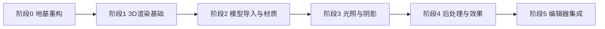

# 3D 图形引擎路线图

> 目标：把 MEngine 从当前"2D 渲染引擎"升级为支持**模型导入 + 3D 渲染**的图形引擎，逐步加入体积光、降噪等常用效果，体验向 Blender / UE 靠拢。
>
> 原则：**小步快跑，每阶段可运行、可验证**。必要时允许重构现有结构（已获授权）。
>
> **当前进度**：见 [status.md](./status.md)。M1（3D 渲染地基：Mesh + 透视相机 + 光照）已完成 ✅。

## 现状评估（做 3D 前必须认清）

| 维度 | 现状 | 对 3D 的影响 |
| --- | --- | --- |
| 渲染 | 2D Sprite（四边形 VAO + 默认 shader 硬编码） | 需彻底重构为 Mesh 驱动 |
| 相机 | 2D 正交（`Camera2D`/`OrthographicCamera`） | 需引入透视相机 + 轨道控制 |
| 资源 | Texture/Shader/FrameBuffer 有 Backend 抽象 | 可复用，需新增 Mesh/Vertex/Index Buffer Backend |
| RHI | `IRHI` 抽象已存在，OpenGL 可用，Vulkan 空壳 | 需补全 Vulkan 或先以 OpenGL 为主做 3D |
| 场景 | ECS（EnTT）+ `Transform`(3D 语义) | 可复用，需新增网格/材质组件 |
| 编辑器 | ImGui 原型，有内容浏览器/视口 | 需加资产导入、材质编辑、Gizmo（ImGuizmo 已引入） |
| 序列化 | `LoadScene/SaveScene` 未实现 | 需实现场景/资产序列化 |

## 需要重构的部分（在 3D 工作前/中完成）

1. **Render 层去 2D 硬编码**：`Renderer` 不再持有写死的四边形 VAO 和默认 shader，改为通用 `DrawMesh(mesh, material, transform)`。
2. **RHI/Backend 补全**：新增 `IMeshBackend`（或 `IVertexBuffer/IIndexBuffer`）抽象；`Vulkan*Backend` 空壳要么补全、要么先标记为未实现并隔离。
3. **相机统一**：引入 `Camera`（透视 + 正交）基类，替换 `Camera2D`/`OrthographicCamera` 的重复实现。
4. **清理冗余**：合并/删除 `RenderContext`（与 `RenderPass` 重复）。
5. **资源生命周期**：为 Mesh/Texture/Material 建立统一缓存与路径加载约定。

---

## 阶段划分

### 阶段 0 — 地基重构（先做，1 步到位）

- 重构 `Renderer`：新增 `Mesh`、`VertexBuffer`、`IndexBuffer` 及对应 Backend（OpenGL 先实现，Vulkan 留桩）。
- 引入 `Camera` 基类（透视 + 正交），`Camera2D` 逐步收敛为"正交相机的一种"。
- 删除/合并 `RenderContext`，统一到 `RenderPass`/`RenderPipeline`。
- 建立 `MeshLibrary` / `MaterialLibrary` 等资源缓存，与 `ShaderLibrary`/`TextureLibrary` 对齐。

### 阶段 1 — 3D 渲染基础

- 手写立方体/平面网格，用透视相机渲染（验证 MVP 矩阵、深度测试、背面剔除）。
- 统一 Vertex 布局（Position/Normal/TexCoord/Tangent）。
- 基本 `Material`：漫反射纹理 + 简单光照（Blinn-Phong）。
- 场景图（Transform 父子层级），支持实体级变换。
- 编辑器：3D 视口 + 轨道相机（旋转/平移/缩放）。

### 阶段 2 — 模型导入与资产

- 引入 **Assimp** 或 **tinygltf**（推荐：glTF 2.0 优先，现代且编辑器友好）。
- 支持 `.obj` / `.fbx` / `.gltf` 导入：网格、法线、UV、材质纹理。
- 资产导入管线：拖拽到内容浏览器 → 解析 → 缓存 Mesh/Material。
- `Scene::Save/Load` 序列化（JSON 或二进制）。

### 阶段 3 — 光照与阴影

- 多光源：方向光 / 点光 / 聚光；统一 light uniform 结构。
- 阴影映射（Shadow Mapping）：方向光为主，点光（cube shadow）后续。
- PBR 材质：albedo / metallic / roughness / normal 贴图，环境光照。
- 天空盒 / IBL（Image Based Lighting）。

### 阶段 4 — 后处理与"渲染常用效果"

按性价比排序：

1. **HDR + Tone Mapping**（ACES）+ Gamma 校正 —— 基础但观感提升巨大。
2. **Bloom（泛光）** —— 体积光/发光效果的常见搭档。
3. **SSAO**（屏幕空间环境光遮蔽）—— 增加接触阴影细节。
4. **体积光（Volumetric Light / God Rays）** —— 屏幕空间光线步进（ray marching），或体积雾。
5. **TAA / 降噪（Denoising）** —— 为光追或体积光降噪；纯光栅阶段可先做 TAA 抗锯齿。
6. （可选进阶）**延迟渲染（Deferred Shading）**，为大量动态光源铺路。

> 建议顺序：先 HDR/Bloom/ToneMapping（阶段 4a），再 SSAO + 体积光（阶段 4b），最后 TAA/降噪（阶段 4c）。光追/降噪放到中后期，依赖资源预算与后端成熟度。

### 阶段 5 — 编辑器集成

- 资产导入 UI（拖拽导入 + 预览）。
- 材质编辑器（贴图槽、参数调节）。
- 场景层级树（父子、显示/隐藏、选中）。
- Gizmo（**ImGuizmo** 已引入，可直接接平移/旋转/缩放）。
- 属性面板支持 Mesh/Material 组件编辑。

---

## 技术选型建议

| 事项 | 建议 |
| --- | --- |
| 模型导入 | **tinygltf**（glTF 2.0）为主，Assimp 作为多格式补充 |
| 数学 | 继续用 GLM（已引入） |
| 渲染后端 | **先以 OpenGL 4.6 为主**完成 3D 全流程，再补全 Vulkan |
| 场景序列化 | JSON（nlohmann/json 或 RapidJSON，或自研轻量序列化） |
| 调试 UI | ImGui + ImGuizmo（已引入） |

## 每阶段完成标准

- 可编译、可运行（sandbox 或 editor 中可见）。
- 有对应的 shader 与演示资源。
- 文档同步更新（本目录）。
