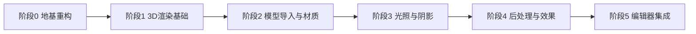

# 引擎路线图

> 目标：一个同时支持 **2D 与 3D** 的轻量游戏引擎 —— 模型导入、PBR 与后期效果、独立的 2D 精灵路径，
> 配 ImGui 编辑器，体验向 Blender / UE / Godot 靠拢。
>
> 原则：**小步快跑，每阶段可运行、可验证**。必要时允许重构现有结构。
>
> **当前进度**：见 [status.md](./status.md)。M1（3D 地基）+ M2a/M2b（OBJ/glTF 导入）+ M3a（PBR 材质）+
> M3b（阴影映射）+ M3c（点光源）+ M3d（软阴影/点光阴影/聚光）+ M4a（HDR/Bloom）+ M4b（天空盒/IBL）+
> M4c（HDR 环境/预过滤镜面 IBL）+ M4d（SSAO）+ M4e（体积光）+ M4f（TAA）+ M5（编辑器 3D 化 + 资产工作流）+
> M6（LO 移植期）+ **M7（2D 支持：场景维度 + 独立 2D 路径 + 2D 编辑器视口）** 已完成 ✅。
> 后续方向见文末「下一步」。

## 现状评估（做 3D 前必须认清）

| 维度 | 现状 | 对后续的影响 |
| --- | --- | --- |
| 渲染 | 两条一等路径：3D Mesh 驱动 PBR 管线（阴影/IBL/SSAO/体积光/TAA）与独立 2D 精灵管线（平铺/帧动画） | 后续补多网格/多材质、间接绘制、2D tilemap/图集 |
| 相机 | 统一 `Camera`（透视 + 正交）+ 编辑器轨道相机 + 2D 正交视口 | 可扩展脚本化相机控制 |
| 资源 | `AssetManager`（manifest 映射）+ Shader/Texture 库 | 可扩展 Mesh 库、模型缩略图 |
| RHI | `IRHI` 抽象存在，OpenGL 可用，Vulkan 空壳 | 需补全 Vulkan 或先以 OpenGL 为主 |
| 场景 | ECS（EnTT）+ `Transform`/`MeshComponent`/`ModelComponent`/`SpriteComponent`/`CameraComponent` | 已支持序列化、父子层级、场景维度 |
| 编辑器 | 3D 视口 + 2D 视口 + 轨道相机 + Gizmo + 模型导入 + 材质编辑 | 可补多选、撤销/重做、资产预览 |
| 序列化 | `SaveScene` / `OpenSceneFile`（JSON，含 `dimension`）已实现，编辑器与独立播放器共用 | 已够用；可补版本迁移 |

## 需要重构的部分

1. ✅ **Render 层去 2D 硬编码**：`Renderer` 已是通用 `DrawMesh*` + 阶段式接口；2D 现在是独立且完整的第二条路径（M7）。
2. ⏳ **RHI/Backend 补全**：`IVertexArrayBackend` 已有 OpenGL 实现；`Vulkan*Backend` 仍是空壳，待补全或标记未实现并隔离。
3. ✅ **相机统一**：统一 `Camera`（透视 + 正交）替换了 `Camera2D`/`OrthographicCamera`/`PerspectiveCamera`。
4. ✅ **清理冗余**：`RenderContext` / `RenderPass` / `RenderPipeline` / `core/command.hpp` 均已删除（无引用）。
5. ✅ **资源生命周期**：`AssetManager`（manifest 映射）+ `ShaderLibrary`/`TextureLibrary` 统一缓存与路径加载。

---

## 阶段划分

```mermaid
graph LR
    A[阶段0 地基重构] --> B[阶段1 3D渲染基础]
    B --> C[阶段2 模型导入与材质]
    C --> D[阶段3 光照与阴影]
    D --> E[阶段4 后处理与效果]
    E --> F[阶段5 编辑器集成]
```

### 阶段 0 — 地基重构（先做，1 步到位）✅ 已完成

- ✅ 重构 `Renderer`：新增 `Mesh`、`VertexBuffer`、`IndexBuffer` 及对应 Backend（OpenGL 先实现，Vulkan 留桩）。
- ✅ 引入统一 `Camera`（透视 + 正交），替换 `Camera2D`/`OrthographicCamera`/`PerspectiveCamera`。
- ✅ 删除/合并 `RenderContext` / `RenderPass` / `RenderPipeline`（已全部删除，直接调用 RHI + 子模块）。
- ✅ 建立 `ShaderLibrary`/`TextureLibrary` 等资源缓存，`AssetManager` 统一资产加载。

### 阶段 1 — 3D 渲染基础

- 手写立方体/平面网格，用透视相机渲染（验证 MVP 矩阵、深度测试、背面剔除）。
- 统一 Vertex 布局（Position/Normal/TexCoord/Tangent）。
- 基本 `Material`：漫反射纹理 + 简单光照（Blinn-Phong）。
- 场景图（Transform 父子层级），支持实体级变换。
- 编辑器：3D 视口 + 轨道相机（旋转/平移/缩放）。

### 阶段 2 — 模型导入与资产

- 引入 **Assimp** 或 **tinygltf**（推荐：glTF 2.0 优先，现代且编辑器友好）。
- 支持 `.obj` / `.fbx` / `.gltf` 导入：网格、法线、UV、材质纹理。
- 资产导入管线：拖拽到内容浏览器 → 解析 → 缓存 Mesh/Material。
- `Scene::Save/Load` 序列化（JSON 或二进制）。

### 阶段 3 — 光照与阴影

- 多光源：方向光 / 点光 / 聚光；统一 light uniform 结构。
- 阴影映射（Shadow Mapping）：方向光为主，点光（cube shadow）后续。
- PBR 材质：albedo / metallic / roughness / normal 贴图，环境光照。
- 天空盒 / IBL（Image Based Lighting）。

### 阶段 4 — 后处理与"渲染常用效果"

按性价比排序：

1. **HDR + Tone Mapping**（ACES）+ Gamma 校正 —— 基础但观感提升巨大。
2. **Bloom（泛光）** —— 体积光/发光效果的常见搭档。
3. **SSAO**（屏幕空间环境光遮蔽）—— 增加接触阴影细节。
4. **体积光（Volumetric Light / God Rays）** —— 屏幕空间光线步进（ray marching），或体积雾。
5. **TAA / 降噪（Denoising）** —— 为光追或体积光降噪；纯光栅阶段可先做 TAA 抗锯齿。
6. （可选进阶）**延迟渲染（Deferred Shading）**，为大量动态光源铺路。

> 建议顺序：先 HDR/Bloom/ToneMapping（阶段 4a），再 SSAO + 体积光（阶段 4b），最后 TAA/降噪（阶段 4c）。光追/降噪放到中后期，依赖资源预算与后端成熟度。

### 阶段 5 — 编辑器集成

- 资产导入 UI（拖拽导入 + 预览）。
- 材质编辑器（贴图槽、参数调节）。
- 场景层级树（父子、显示/隐藏、选中）。
- Gizmo（**ImGuizmo** 已引入，可直接接平移/旋转/缩放）。
- 属性面板支持 Mesh/Material 组件编辑。

---

## 技术选型建议

| 事项 | 建议 |
| --- | --- |
| 模型导入 | **tinygltf**（glTF 2.0）为主，Assimp 作为多格式补充 |
| 数学 | 继续用 GLM（已引入） |
| 渲染后端 | **先以 OpenGL 4.6 为主**完成 3D 全流程，再补全 Vulkan |
| 场景序列化 | JSON（nlohmann/json 或 RapidJSON，或自研轻量序列化） |
| 调试 UI | ImGui + ImGuizmo（已引入） |

## 每阶段完成标准

- 可编译、可运行（sandbox 或 editor 中可见）。
- 有对应的 shader 与演示资源。
- 文档同步更新（本目录）。
