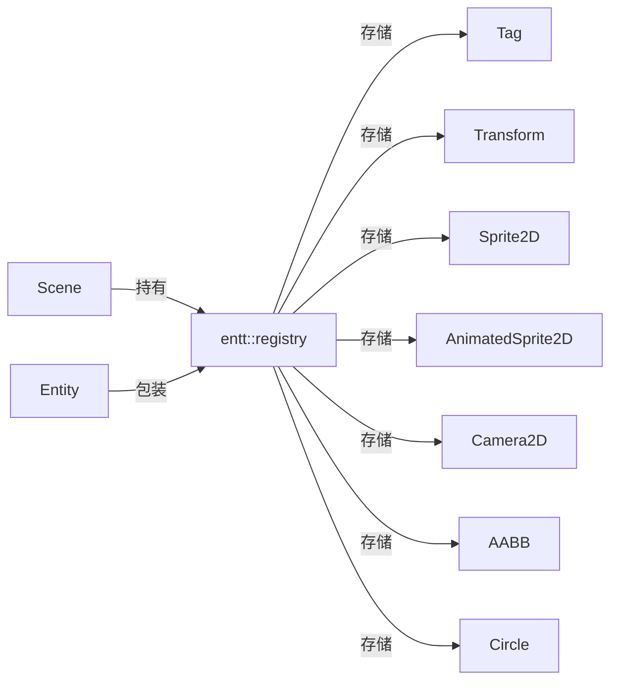
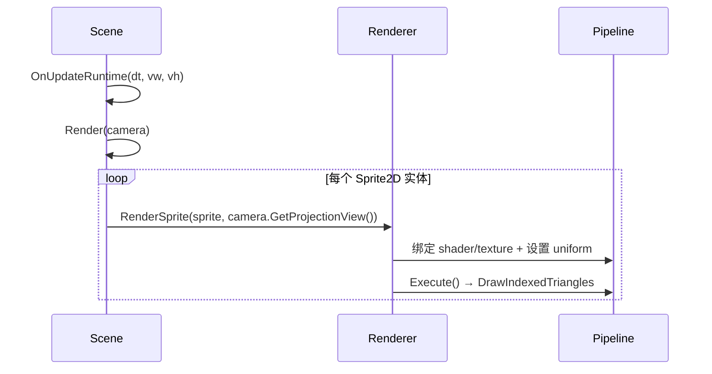

# 场景层（scene）

路径：`engine/src/scene`

## ECS 架构

基于 EnTT 的 ECS（Entity-Component-System）：

- `Scene` 内部持有 `entt::registry registry_` 作为组件存储。
- `Entity` 是 `entt::entity + entt::registry*` 的轻量包装，提供模板化组件操作。
- 组件是纯数据结构（`component.hpp`），系统逻辑目前直接写在 `Scene` 的成员函数里（尚未抽成独立 System）。



## Entity

关键 API（`entity.hpp`）：

```cpp
template <typename T, typename... Args> T& AddComponent(Args&&...);
template <typename T> T& GetComponent();
template <typename T> bool HasComponent();
template <typename T> void RemoveComponent();
entt::entity GetHandle() const;
```

- `operator==/!=` 同时比较 `handle` 与 `registry` 指针。

## 组件（component.hpp）

| 组件 | 字段 | 说明 |
| --- | --- | --- |
| `Tag` | `std::string tag` | 实体名称 |
| `Transform` | `translation/rotation/scale`（vec3） | 3D 变换，`GetTransform()` 用四元数构建 TRS 矩阵 |
| `Camera2D` | `position/rotation/aspect_ratio/zoom_level/primary` + `view/projection` | 2D 正交相机（数据），含投影/视图矩阵计算 |
| `Sprite2D` | `position/scale/rotation/color/texture/tiling_factor` | 2D 精灵，`GetModelMatrix()` 构建模型矩阵 |
| `AnimatedSprite2D` | 同上 + `h_frames/v_frames/frame_time/current_frame` | 帧动画精灵 |
| `MeshComponent` | `mesh`(Ref\<Mesh\>)/`shader`(Ref\<Shader\>)/`texture`(可选) | 3D 网格渲染（M1 新增，需配合 `Transform`） |
| `AABB` | `position/scale` | 轴对齐包围盒 |
| `Circle` | `position/radius` | 圆形碰撞体 |

> 注意：`Transform` 是 3D 语义的（vec3 + 四元数旋转），但当前渲染路径只用到 2D 的 `Sprite2D`。这是 3D 化的现成基础。

## Scene

关键成员与 API（`scene.hpp`）：

- `CreateEntity(name)`：创建实体并自动加 `Tag`，追加到 `entities_`。
- `DestroyEntity(entity)`：销毁实体（TODO 标记，基本实现）。
- `GetAllEntitiesWith<Components...>()`：返回满足组件组合的实体列表。
- `GetAllEntities()`：全部实体。
- `LoadScene/SaveScene(path)`：**TODO，未实现**。
- `OnUpdateEditor(camera)` / `OnUpdateSimulation(dt, camera)`：编辑器/模拟更新（后者 TODO）。
- `OnUpdateRuntime(dt, vw, vh)`：运行时更新——找 primary 相机，设置投影并渲染；无 primary 相机则用默认相机。
- `Render(camera)`：遍历 `Sprite2D` 与 `AnimatedSprite2D` 实体，调用 `renderer_->RenderSprite(...)`。
- `RenderMeshes(proj_view, camera_pos)`：遍历带 `MeshComponent` 的实体，结合 `Transform` 计算 model 矩阵后绘制（M1 新增）。

## 相机

- `Camera2D`（component）与 `OrthographicCamera`（`camera.hpp`，包装 `Camera2D` 引用）：
  - `SetProjection(left,right,bottom,top)`：`glm::ortho`（近远 -1..1）。
  - `OnWindowResize / OnMouseScroll`：调整 aspect / zoom。
  - `RecalculateViewMatrix()`：由 position + rotation(z 轴) 计算逆变换得到 view。
  - `GetProjectionView()`：`projection * view`。
- `PerspectiveCamera`（`perspective_camera.hpp`，M1 新增）：透视相机，lookAt 模型（position/target/up + fov/aspect/near/far），提供 `GetViewMatrix/GetProjectionMatrix/GetProjectionView`。目前为独立类，尚未进入 ECS。
- 注意：`OrthographicCamera` 与 `Camera2D` 功能高度重叠，3D 化时应统一相机体系（透视 + 正交的 `Camera` 基类）。

## 渲染路径（当前 2D）



## 3D 化的衔接点

- `Transform`（TRS + 四元数）已经是 3D 语义，可直接复用于 3D 网格。
- 需要新增：`MeshRenderer`/`StaticMesh`/`Material` 等组件、透视相机、场景图（父子层级）。
- `Scene::LoadScene/SaveScene` 尚未实现，是资产/场景序列化的切入点。
- 详见 [roadmap.md](./roadmap.md)。
