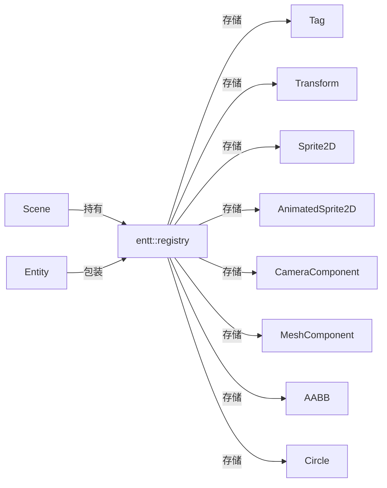

# 场景层（scene）

路径：`engine/src/scene`

## ECS 架构

基于 EnTT 的 ECS（Entity-Component-System）：

- `Scene` 内部持有 `entt::registry registry_` 作为组件存储。
- `Entity` 是 `entt::entity + entt::registry*` 的轻量包装，提供模板化组件操作。
- 组件是纯数据结构（`component.hpp`），系统逻辑目前直接写在 `Scene` 的成员函数里（尚未抽成独立 System）。



## Entity

关键 API（`entity.hpp`）：

```cpp
template <typename T, typename... Args> T& AddComponent(Args&&...);
template <typename T> T& GetComponent();
template <typename T> bool HasComponent();
template <typename T> void RemoveComponent();
entt::entity GetHandle() const;
```

- `operator==/!=` 同时比较 `handle` 与 `registry` 指针。

## 组件（component.hpp）

| 组件 | 字段 | 说明 |
| --- | --- | --- |
| `Tag` | `std::string tag` | 实体名称 |
| `Transform` | `translation/rotation/scale`（vec3） | 3D 变换，`GetTransform()` 用四元数构建 TRS 矩阵 |
| `CameraComponent` | `camera`（`Camera`）+ `primary`（bool） | 相机组件：透视/正交一体的 `Camera`，`primary` 标记运行时主相机 |
| `Sprite2D` | `position/scale/rotation/color/texture/tiling_factor` | 2D 精灵，`GetModelMatrix()` 构建模型矩阵 |
| `AnimatedSprite2D` | 同上 + `h_frames/v_frames/frame_time/current_frame` | 帧动画精灵 |
| `MeshComponent` | `mesh`(Ref\<Mesh\>)/`material`(Ref\<Material\>) | 3D 网格渲染，需配合 `Transform` |
| `AABB` | `position/scale` | 轴对齐包围盒 |
| `Circle` | `position/radius` | 圆形碰撞体 |

> 注意：`Transform` 是 3D 语义的（vec3 + 四元数旋转），但当前渲染路径只用到 2D 的 `Sprite2D`。这是 3D 化的现成基础。

## Scene

关键成员与 API（`scene.hpp`）：

- `CreateEntity(name)`：创建实体并自动加 `Tag`，追加到 `entities_`。
- `DestroyEntity(entity)`：销毁实体（TODO 标记，基本实现）。
- `GetAllEntitiesWith<Components...>()`：返回满足组件组合的实体列表。
- `GetAllEntities()`：全部实体。
- `LoadScene/SaveScene(path)`：**TODO，未实现**。
- `OnUpdateEditor(camera)` / `OnUpdateSimulation(dt, camera)`：编辑器/模拟更新（后者 TODO）。
- `OnUpdateRuntime(dt, vw, vh)`：运行时更新——找 primary 相机，设置投影并渲染；无 primary 相机则用默认相机。
- `Render(camera)`：遍历 `Sprite2D` 与 `AnimatedSprite2D` 实体，调用 `renderer_->RenderSprite(...)`。
- `RenderMeshes(proj_view, camera_pos)`：遍历带 `MeshComponent` 的实体，结合 `Transform` 计算 model 矩阵后绘制（M1 新增）。

## 相机

统一的 `Camera`（`camera.hpp`）取代了旧的 `Camera2D`/`OrthographicCamera`/`PerspectiveCamera`：

- `ProjectionType { Perspective, Orthographic }`：同一相机类支持两种投影。
- 字段：`fov_degrees/ortho_size/near_plane/far_plane/aspect_ratio` + `position/rotation`（欧拉角，度）。
- 方法：`LookAt(target)`、`GetForward()`、`GetViewMatrix()`、`GetProjectionMatrix()`、`GetProjectionView()`。
- `CameraComponent`（`component.hpp`）把 `Camera` 挂到实体上，`primary` 标记运行时使用的主相机。
- 编辑器使用独立的轨道相机 `EditorCamera`（`editor/src/editor_camera.hpp`，target/yaw/pitch/distance 模型）。

## 渲染路径（当前 3D）

- `Scene::RenderMeshes(view, proj, camera_pos, target_fbo=0, target_w=0, target_h=0)`：阴影 pass → SSAO → 主 PBR pass（含天空盒）→ 后处理合成；`target_fbo` 指定最终合成目标（0 = 默认帧缓冲，编辑器传入视口 FBO）。
- 2D 精灵路径（`Render`/`RenderSprite`）仍保留，但不再是主路径。

## 3D 化的衔接点

- `Transform`（TRS + 四元数）已是 3D 语义，直接用于 3D 网格。
- `Scene::LoadScene/SaveScene` 尚未实现，是资产/场景序列化的切入点。
- 详见 [roadmap.md](./roadmap.md)。
