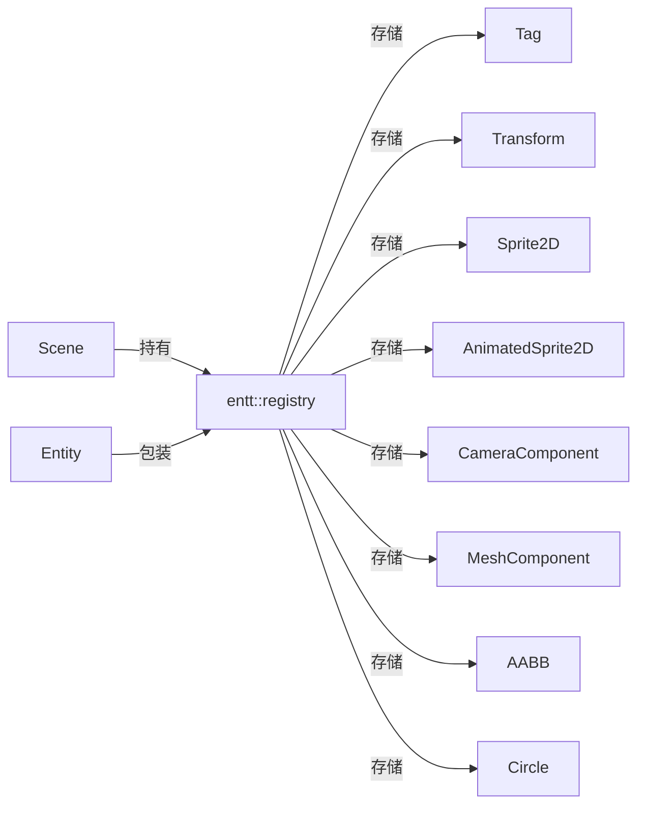

# 场景层（scene）

路径：`engine/src/scene`

## ECS 架构

基于 EnTT 的 ECS（Entity-Component-System）：

- `Scene` 内部持有 `entt::registry registry_` 作为组件存储。
- `Entity` 是 `entt::entity + entt::registry*` 的轻量包装，提供模板化组件操作。
- 组件是纯数据结构（`component.hpp`），系统逻辑目前直接写在 `Scene` 的成员函数里（尚未抽成独立 System）。


```mermaid
graph LR
    Scene["Scene"] -->|持有| Registry["entt::registry"]
    Registry -->|存储| C1[Tag]
    Registry -->|存储| C2[Transform]
    Registry -->|存储| C3[Sprite2D]
    Registry -->|存储| C4[AnimatedSprite2D]
    Registry -->|存储| C5[CameraComponent]
    Registry -->|存储| C6[MeshComponent]
    Registry -->|存储| C7[AABB]
    Registry -->|存储| C8[Circle]
    Entity -->|包装| Registry
```

## Entity

关键 API（`entity.hpp`）：

```cpp
template <typename T, typename... Args> T& AddComponent(Args&&...);
template <typename T> T& GetComponent();
template <typename T> bool HasComponent();
template <typename T> void RemoveComponent();
entt::entity GetHandle() const;
```

- `operator==/!=` 同时比较 `handle` 与 `registry` 指针。

## 组件（component.hpp）

| 组件 | 字段 | 说明 |
| --- | --- | --- |
| `Tag` | `std::string tag` + `editor_only` | 实体名称（`editor_only` 的实体不参与保存/Play 快照） |
| `Transform` | `translation/rotation/scale`（vec3） | 变换，`GetTransform()` 用四元数构建 TRS 矩阵 |
| `CameraComponent` | `camera`（`Camera`）+ `primary`（bool） | 相机组件：透视/正交一体的 `Camera`，`primary` 标记运行时主相机 |
| `SpriteComponent` | `texture/color/uv_rect/size/tiling/flip_x/flip_y/sorting_layer/order_in_layer` | **2D 精灵**（`render/sprite.hpp`）：`GetQuad()` 按 `uv_rect`+翻转+平铺缓存单位四边形，`GetMaterial()` 按贴图+tint 缓存 unlit 混合材质；`SetSheetFrame/SetWholeTexture/FitPixels/SetTiledSize`（后者按贴图尺寸换算重复次数，保证纹素是方的） |
| `SpriteAnimationComponent` | `sheet/first_frame/frame_count/fps/loop/ping_pong/playing/play_while_moving/time/frame` | 帧动画：`SpriteSheet` 网格逐帧写回同实体的 `SpriteComponent::uv_rect`（`Scene::StepSimulation` 里统一推进；编辑器 Edit 模式 2D 场景也调 `UpdateSpriteAnimations` 预览）。`play_while_moving` = 走路循环模式（只在实际移动时播，停下回第 0 帧） |
| `MeshComponent` | `mesh`(Ref\<Mesh\>)/`material`(Ref\<Material\>) | 3D 网格渲染，需配合 `Transform` |
| `ModelComponent` | `model`(Ref\<Model\>)/`source` | 多材质模型（单个实体多个 part），光照/阴影/合批与 `MeshComponent` 一致 |
| `RigidBody` / `Collider` | 质量/速度/形状等 | Jolt 物理，`StepSimulation` 固定步长推进 |
| `AnimationComponent` | `rotation`/`translation`/`scale` 关键帧通道 | 时间轴关键帧动画（editor Timeline 面板） |

> 注意：`Transform` 是 3D 语义的（vec3 + 四元数旋转）；2D 精灵就用它的 `translation.xy`。
> 一个场景要么是 2D 要么是 3D（见下文「场景维度」）。

**灯光组件（Light 组件化 v1 + v2）**：`DirectionalLightComponent` / `PointLightComponent` /
`SpotLightComponent`（ECS）——灯挂到实体上，点/聚光位置取实体的世界 `Transform`（可用 Gizmo/层级移动），
颜色/强度/半径/锥角/方向等存组件内。场景里只要存在带灯光组件的实体，`Scene::RenderMeshes` 每帧就会从
这些实体重建 renderer 的点/聚光列表，并把（首个）`DirectionalLightComponent` 拷入 renderer 的方向光
（renderer 仍只支持 1 个方向光）；无组件时旧的 `Scene::GetLight/SetLight`、`AddPointLight`/`AddSpotLight`
列表 API 行为完全不变。灯光组件**已按实体级序列化**（`.scene` 的 entities 里存 `directional_light` /
`point_light` / `spot_light`，保存/加载/Play 快照一致）；当场景存在组件灯时不再写旧的顶层灯光数组
（旧文件仍兼容读回）。Editor 的 Create 菜单可建三类灯实体，Properties 可编辑对应组件；Lighting 面板在
有方向光实体时自动提示改用实体编辑。

## Scene

关键成员与 API（`scene.hpp`）：

- `CreateEntity(name)`：创建实体并自动加 `Tag`，追加到 `entities_`。
- `DestroyEntity(entity)`：销毁实体（TODO 标记，基本实现）。
- `GetAllEntitiesWith<Components...>()`：返回满足组件组合的实体列表。
- `GetAllEntities()`：全部实体。
- `LoadScene/SaveScene(path)`：**已实现**（`scene_serializer.cpp`，JSON）：顶层 `dimension`（`"2d"`/`"3d"`）+ 实体（Tag/Transform/MeshComponent(含材质)/ModelComponent/CameraComponent/RigidBody/Collider/CameraController/SpriteComponent/SpriteAnimationComponent）+ 灯光 + 渲染参数；
  材质贴图以相对 assets 根存储。editor 的 File→Open/Save/Save As 与 Play 快照均走它。
- `GetContentBounds(min, max)`：场景内所有可渲染物（网格/模型 part/精灵四边形）的世界 AABB，供编辑器取景用。
- `RenderMeshes(...)` / `Render2D(...)` / `RenderFromPrimaryCamera(...)`：见下文。
- 已删除：`Render/OnUpdateEditor/OnUpdateSimulation/OnUpdateRuntime`（开发期的多入口渲染函数，现在只有
  上面两条显式路径 + `StepSimulation(dt)` 这一个更新入口）。

## 场景维度（SceneDimension）

场景是 **2D 或 3D 之一**（`SceneDimension::Scene2D/Scene3D`，与 Unity 的 2D/3D 模板、Godot 的
2D/3D 视口同构），随 `.scene` 文件的 `"dimension"` 字段持久化：

- 旧文件没有该字段时**推断**：主相机是正交 → 2D，否则 3D（向后兼容）。
- `SetDimension(Scene2D)` 会一并应用 2D 默认值（关天空盒/SSAO/TAA/Bloom/God Rays/IBL，背景色若仍是纯黑
  则换成深蓝灰），因为 2D 路径根本不会执行这些 3D 阶段。
- `Is2D()` 决定：`RenderFromPrimaryCamera` 走哪条路径、编辑器显示哪个视口面板、Launch 起哪个 sandbox。
- `EnsurePrimaryCamera2D(ortho_size, z)`：保证存在一个正交主相机（没有就建 `Main Camera`），是新建 2D 场景的第一步。

## 相机

统一的 `Camera`（`camera.hpp`）取代了旧的 `Camera2D`/`OrthographicCamera`/`PerspectiveCamera`：

- `ProjectionType { Perspective, Orthographic }`：同一相机类支持两种投影。
- 字段：`fov_degrees/ortho_size/near_plane/far_plane/aspect_ratio` + `position/rotation`（欧拉角，度）。
- 方法：`LookAt(target)`、`GetForward()`、`GetViewMatrix()`、`GetProjectionMatrix()`、`GetProjectionView()`。
- `CameraComponent`（`component.hpp`）把 `Camera` 挂到实体上，`primary` 标记运行时使用的主相机。
- 编辑器使用独立的轨道相机 `EditorCamera`（`editor/src/editor_camera.hpp`，target/yaw/pitch/distance 模型）。

## 渲染路径

两条互斥的路径，由场景维度选择（`Scene::RenderFromPrimaryCamera` 是唯一的入口）：

- **3D**：`Scene::RenderMeshes(view, proj, camera_pos, target_fbo=0, target_w=0, target_h=0)` ——
  阴影 pass → 点光阴影 → SSAO → 主 PBR pass（不透明/半透明分批实例化，含天空盒）→ 后处理合成；
  `target_fbo` 指定最终合成目标（0 = 默认帧缓冲，编辑器传视口 FBO）。
- **2D**：`Scene::Render2D(view, proj, target_fbo=0, target_w=0, target_h=0)` —— 收集
  `SpriteComponent` → painter 排序（layer → order → z）→ 合批 → `Renderer::Begin2DScene` /
  `DrawSprites2D` / `End2DScene`。不经任何 3D 阶段与后处理，像素级等于美术图（详见
  [rendering.md](./rendering.md) 的「2D 场景」一节）。
- 3D 场景里的精灵仍会画：它们进 3D 主 pass 的半透明通道（HDR + tone mapping + 按层/深度排序）。

## 3D 化的衔接点

- `Transform`（TRS + 四元数）已是 3D 语义，直接用于 3D 网格。
- `Scene::LoadScene/SaveScene` 已实现（JSON 序列化），编辑器与 Play 快照在用。
- 详见 [roadmap.md](./roadmap.md)。
