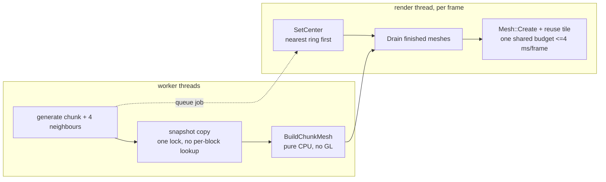

# voxel — Minecraft-like tech demo

A standalone example target that builds a small voxel world on top of the
**engine's public API only** (no `engine/src` code is modified for it — the
engine stays generic).

It covers three things you asked for:

- **A. Terrain** — **endless, procedurally generated** world (deterministic
  value-noise heightmap: grass/dirt/stone/sand + oak trees) that **streams in
  chunks around the player** (each 16×16 chunk one engine `Mesh`/`Scene`
  entity). Blocks use one pbr material whose albedo is a **procedurally
  generated texture atlas** (CPU pixels uploaded via `Texture::SetData`). Side
  faces are UV-unwrapped so tiles are never rotated (grass-green always on top
  of a grass side). Sun light + directional shadows + skybox come from
  `Scene::RenderMeshes`.
  - **Chunk loading is asynchronous (Minecraft-style):** worker threads
    generate voxel data and mesh it, while the render thread only uploads a
    **budget-limited number of finished meshes per frame** (never more than
    ~4 ms). Crossing a chunk border no longer rebuilds the world — chunks are
    loaded/unloaded individually around the player, so rendering never stops
    while terrain streams in. See “Streaming architecture” below.
  - **Loaded chunks stay resident:** two rings, like Minecraft's render vs
    simulation distance — an inner *load* ring that actively streams in/out
    (radius 5) and a larger *keep* ring (radius 8, `MENGINE_VOXEL_KEEP`) whose
    chunks keep their data, entities and meshes and **keep being rendered**.
    Terrain you already walked through therefore stays on screen when you look
    back instead of popping out of existence, and walking back over it needs no
    regeneration at all. Only chunks beyond the keep ring are unloaded.
- **B. Player movement + collision** — first-person camera (mouse capture),
  WASD, jump, gravity, and **custom AABB-vs-voxel collision** (axis-separated
  integration with revert) — voxel terrain is *not* a physics-engine rigid
  body.
- **C. Place / break** — center-screen voxel raycast (reach 6), LMB breaks,
  RMB places the hotbar block (the affected chunk + neighbours are re-meshed on
  a worker thread; the edit itself is immediate, so collision/picking see it
  right away).
- **Fly** — press **F**, or double-press **Space**, to toggle fly (Space = up,
  Shift/Ctrl = down).

## Streaming architecture



**Two rings (Minecraft-style load vs render distance)**

```
     keep ring (radius 8)              chunks stay populated + rendered,
   +---------------------+             only torn down when they leave it
   |   load ring (r=5)   |
   |   +-----------+     |             generated + meshed as the player moves;
   |   |  player   |     |             resident chunks that come back need
   |   +-----------+     |             no remesh at all
   +---------------------+
```

- `ChunkStreamer` owns the job queue and a small worker pool (cores-1, capped
  at 4). Jobs are ordered nearest-ring-first; a block edit jumps the queue.
  Results carry a per-chunk request id, so a stale mesh (produced before an
  edit) is discarded instead of flashing on screen.
- The world map is shared with the workers, so every `World` accessor is
  thread-safe. Meshing never walks the map: a `ChunkSnapshot` (16×16×40 chunk +
  one-border ring sampled from the 4 XZ neighbours) is copied under **one** lock
  and then read lock-free, which also removed the per-block hash lookup the old
  synchronous mesher did (~60k lookups per chunk).
- Per frame the render thread does a bounded amount of work: at most `3` chunk
  mesh uploads and `8` chunk “parkings” (mesh released, entity pooled), all
  sharing one ~4 ms budget, so a burst of ready chunks is spread over frames.
  Retired tiles are **recycled** (their entities go into a pool and are reused
  for new chunks) — Scene entity create/destroy is what used to cost ~1.3 ms
  per chunk here.
- Physics is gated on the 3×3 chunks under the player (`GroundReady`), so a
  respawn / debug teleport holds the player instead of dropping them through
  unloaded chunks. Chunks beyond the keep ring are unloaded to bound memory.

## Build & run

```sh
cmake --build --preset windows-clang-debug --target voxel
./build/windows-clang-debug/voxel/voxel.exe          # from the build dir
```

The build copies `assets/` next to the exe so the shared skybox/shaders resolve.

## Controls

| Key | Action |
| --- | --- |
| Mouse | look |
| WASD | walk |
| Space | jump (or fly up) |
| Space-Space / F | toggle fly |
| Shift / Ctrl | fly down |
| 1..6 | select block type (grass/dirt/stone/sand/wood/leaves) |
| Esc | release / re-capture the mouse cursor |
| LMB | break block |
| RMB | place block (ghost preview shows the cell) |

Optional environment variables:

| Env var | Meaning |
| --- | --- |
| `MENGINE_VOXEL_SEED=<n>` | world seed (default 1337) |
| `MENGINE_VOXEL_WORKERS=<n>` | chunk-streaming worker threads (default cores-1, max 4) |
| `MENGINE_VOXEL_KEEP=<n>` | resident radius in chunks (default 8, min 7): already-loaded chunks inside it stay rendered after you walk away. Larger = more visible terrain behind you, at the cost of GPU memory (each chunk mesh is a few hundred KB) |
| `MENGINE_VOXEL_DEBUG_CAM="x,y,z,yaw,pitch"` | teleport the camera after spawn |
| `MENGINE_VOXEL_AUTOWALK=<blocks/s>` | unattended test: fly along +X so streaming can be measured headlessly |

## Layout

- `voxel_atlas.{hpp,cpp}` — block registry + CPU texture atlas (tiles, UVs).
- `voxel_world.{hpp,cpp}` — **chunked endless world**: thread-safe chunk map
  (`mutex`-guarded, generation outside the lock), pure `TerrainHeight()` /
  `GenerateChunkData()`, `ChunkSnapshot` (pad-1 copy for lock-free meshing) and
  the chunk mesher (`BuildChunkMesh`, takes a snapshot, not the world).
- `voxel_streamer.{hpp,cpp}` — `ChunkStreamer`: the background worker pool that
  generates + meshes chunks, the job queue (nearest-first, edits jump the
  queue), the load/keep ring bookkeeping (residency), stale-result rejection,
  and the `Drain()` handshake with the render thread.
- `voxel_app.{hpp,cpp}` — the `Application` subclass: player/controller,
  picking, uploads finished chunk meshes under a per-frame budget, renders the
  scene + underwater tint + crosshair.
